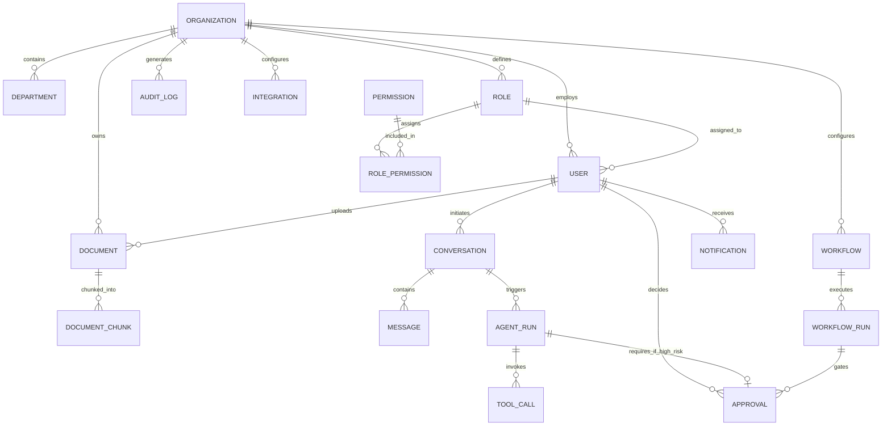

# OmniAgent AI — Entity Relationship Diagram (ERD)

```mermaid
erDiagram
    ORGANIZATION ||--o{ DEPARTMENT : contains
    ORGANIZATION ||--o{ USER : employs
    ORGANIZATION ||--o{ ROLE : defines
    ORGANIZATION ||--o{ DOCUMENT : owns
    ORGANIZATION ||--o{ WORKFLOW : configures
    ORGANIZATION ||--o{ AUDIT_LOG : generates
    ORGANIZATION ||--o{ INTEGRATION : configures

    ROLE ||--o{ ROLE_PERMISSION : assigns
    PERMISSION ||--o{ ROLE_PERMISSION : included_in
    ROLE ||--o{ USER : assigned_to

    USER ||--o{ CONVERSATION : initiates
    USER ||--o{ DOCUMENT : uploads
    USER ||--o{ APPROVAL : decides
    USER ||--o{ NOTIFICATION : receives

    DOCUMENT ||--o{ DOCUMENT_CHUNK : chunked_into
    
    CONVERSATION ||--o{ MESSAGE : contains
    CONVERSATION ||--o{ AGENT_RUN : triggers

    AGENT_RUN ||--o{ TOOL_CALL : invokes
    AGENT_RUN ||--o| APPROVAL : requires_if_high_risk

    WORKFLOW ||--o{ WORKFLOW_RUN : executes
    WORKFLOW_RUN ||--o{ APPROVAL : gates
```
