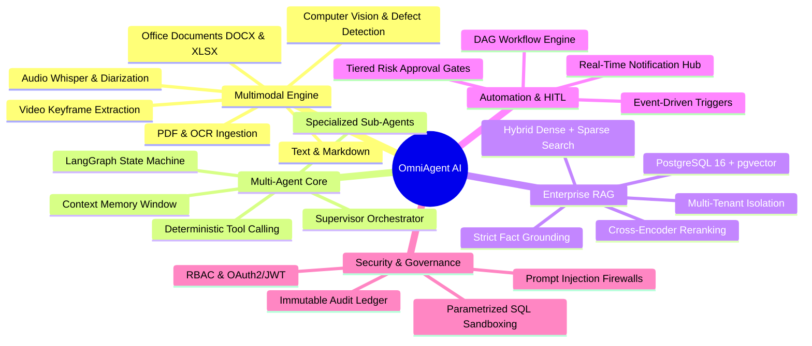

# 01 — Project Overview: OmniAgent AI

## Status
**Status:** ✅ IMPLEMENTED (Core Platform & Multi-Agent Architecture)

---

## 1. Executive Summary

**OmniAgent AI** is a production-grade, enterprise-scale Multimodal Autonomous AI Employee and Workflow Automation Platform. Designed for modern digital operations, OmniAgent AI ingests and contextualizes cross-modal enterprise artifacts—ranging from scanned invoices, machine schematics, and audio dispatches to spreadsheets, relational database records, and live API feeds—and autonomously routes, reasons, executes, and audits complex enterprise workflows.

```
                    ┌─────────────────────────────────────────────────────────┐
                    │               User / External Business Event            │
                    └────────────────────────────┬────────────────────────────┘
                                                 ▼
                    ┌─────────────────────────────────────────────────────────┐
                    │            Multimodal Input Processing Engine           │
                    │  (Text, PDF, DOCX, XLSX, Image/OCR, Audio, Video, DB)   │
                    └────────────────────────────┬────────────────────────────┘
                                                 ▼
                    ┌─────────────────────────────────────────────────────────┐
                    │         AI Supervisor Agent (LangGraph Controller)       │
                    │      (Intent Classification, Planning & Task DAG)       │
                    └────────────────────────────┬────────────────────────────┘
                                                 ▼
                    ┌─────────────────────────────────────────────────────────┐
                    │             Specialized Worker Agent Swarm              │
                    │  ┌──────────────┐ ┌──────────────┐ ┌─────────────────┐  │
                    │  │ Vision Agent │ │Document Agent│ │    RAG Agent    │  │
                    │  └──────┬───────┘ └──────┬───────┘ └────────┬────────┘  │
                    │         │ ┌──────────────┴─┐ ┌──────────────┴─┐         │
                    │         └─┤ Database Agent │ │Reasoning Agent │         │
                    │           └────────────────┘ └────────┬───────┘         │
                    └───────────────────────────────────────┼─────────────────┘
                                                            ▼
                    ┌─────────────────────────────────────────────────────────┐
                    │     Knowledge Retrieval & Enterprise Context Grounding   │
                    │      (pgvector Hybrid RAG, ERP Records, SQL Schema)     │
                    └────────────────────────────┬────────────────────────────┘
                                                 ▼
                    ┌─────────────────────────────────────────────────────────┐
                    │            Deterministic Policy & Tool Calling          │
                    │     (ERP REST APIs, CRM Mutations, Slack, Email SMTP)   │
                    └────────────────────────────┬────────────────────────────┘
                                                 ▼
                    ┌─────────────────────────────────────────────────────────┐
                    │           Human-in-the-Loop Approval Gateway            │
                    │      (LOW: Auto-Execute | MED: Review | HIGH: Block)    │
                    └────────────────────────────┬────────────────────────────┘
                                                 ▼
                    ┌─────────────────────────────────────────────────────────┐
                    │            Real-World Action & External Sync            │
                    └────────────────────────────┬────────────────────────────┘
                                                 ▼
                    ┌─────────────────────────────────────────────────────────┐
                    │          Verification & Immutable Audit Ledger          │
                    │           (HMAC Signature, Execution Telemetry)         │
                    └─────────────────────────────────────────────────────────┘
```

---

## 2. Core Value Proposition

Enterprise organizations operate in heterogeneous data silos where over 80% of actionable business information is locked inside unstructured and multimodal artifacts—scanned PDFs, vendor invoices, factory floor photos, voicemails, incident logs, and legacy relational tables. 

Traditional Robotic Process Automation (RPA) tools fail when confronted with unstructured or semi-structured data variations, while standalone Generative AI chatbots lack deterministic execution, database connectivity, human safety guardrails, and audit compliance.

**OmniAgent AI** bridges this gap by functioning as a reliable, secure AI Employee that:
1. **Understands Everything:** Ingests native text, PDFs, spreadsheets, images, audio, and video without external brittle third-party pipelines.
2. **Reasons with Enterprise Context:** Grounded directly in company knowledge bases using Hybrid RAG (pgvector + BM25) and live database introspection.
3. **Acts Safely:** Enforces Role-Based Access Control (RBAC), sandboxed tool execution, and risk-stratified Human-in-the-Loop (HITL) approval gates.
4. **Verifies and Audits:** Logs every token, tool invocation, intermediate reasoning state, and approval decision into an immutable audit trail.

---

## 3. Target User Personas & Enterprise Departments

| Department | Target Personas | Primary Operational Workflows |
| :--- | :--- | :--- |
| **Finance & Accounting** | Accounts Payable Specialists, Controllers, CFOs | Automated 3-way invoice matching, vendor ledger reconciliations, PO compliance verification. |
| **Human Resources** | HR Business Partners, Operations Leads, Recruiters | Policy interpretation, leave processing, resume scoring, compliant document dispatch. |
| **IT & DevOps** | Tier 1/2 Support Engineers, SREs, System Admins | Screenshot error diagnosis, log summarization, automated Jira/ServiceNow ticket creation. |
| **Manufacturing & Ops** | Plant Quality Engineers, Maintenance Supervisors | Visual defect inspection on machinery, SOP manual lookups, preventive maintenance scheduling. |
| **Customer Support** | Support Agents, Escalation Managers | Multimodal ticket triage (voice + screenshot + text), RMA verification, CRM updates. |
| **Executive & BI** | Department Heads, Strategy Analysts | Cross-department SQL analysis, executive brief synthesis, automated KPI report generation. |

---

## 4. Key Capabilities Matrix



---

## 5. Technology Stack Summary

### Backend Core
* **Language & Runtime:** Python 3.11+
* **Web Framework:** FastAPI with Async I/O (Uvicorn ASGI)
* **Agent Framework:** LangGraph / LangChain Core
* **Data Validation:** Pydantic v2
* **Database ORM:** SQLAlchemy 2.0 (Asyncpg driver) & Alembic migrations
* **Database & Vector Store:** PostgreSQL 16 with `pgvector` extension
* **Caching & Message Broker:** Redis 7+
* **Asynchronous Workers:** Celery / Redis Queue
* **Object Storage:** MinIO / AWS S3 Compatible API
* **Document & Image Processing:** PyMuPDF (fitz), pdfplumber, OpenCV, Pillow, Tesseract OCR, Pandas, openpyxl
* **Audio & Speech:** OpenAI Whisper / Faster-Whisper, PyDub

### Frontend Core
* **Framework:** Next.js 14+ (App Router)
* **UI Architecture:** React 18, TypeScript (Strict Mode)
* **Styling & Components:** Tailwind CSS, Shadcn UI, Radix UI Primitives, Lucide React
* **State Management:** Zustand (Client state), TanStack React Query v5 (Server state)
* **Streaming Protocol:** Server-Sent Events (SSE) & WebSockets

### AI Models & Gateways
* **Primary LLMs:** Anthropic Claude 3.5 Sonnet, OpenAI GPT-4o, Google Gemini 1.5 Pro
* **Local/Self-Hosted LLMs:** Ollama (Llama 3.3 70B, Mistral Nemo, Qwen 2.5 Coder)
* **Embedding Models:** `BAAI/bge-large-en-v1.5` (1024-dim) & `text-embedding-3-large` (1536/3072-dim)
* **Reranking Engine:** `BAAI/bge-reranker-large` / Cross-Encoder

---

## 6. Architecture Highlights

1. **Stateful Multi-Agent Supervisor Pattern:** An intelligent master supervisor breaks down complex user objectives into structured task graphs, delegating work asynchronously to specialized sub-agents and synthesizing final results.
2. **Unified Multimodal Ingestion Layer:** Ingests raw binary files, identifies magic headers, strips unsafe metadata, performs OCR or Whisper transcription where necessary, and routes structured embeddings and tokens to the knowledge store.
3. **Zero-Trust Document Sandboxing:** Untrusted document content is strictly fenced in prompt templates using boundary tokens (`<<<UNTRUSTED_CONTENT>>>`) to prevent indirect prompt injection and unauthorized command execution.
4. **Deterministic Three-Tier Approval System:** Actions that mutate financial ledgers, external databases, or send outbound communications require cryptographic supervisor signatures and human authorization based on calculated risk weights.
