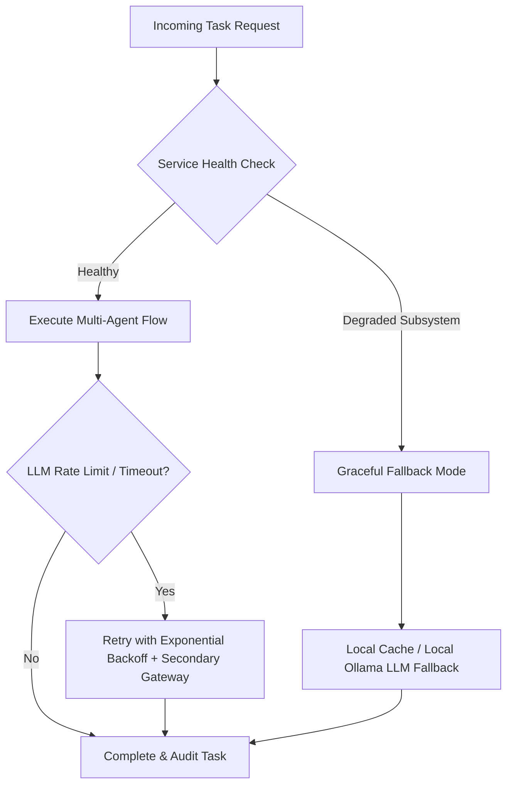

# 03 — Goals and Objectives: Engineering & Business SLAs

## Status
**Status:** ✅ IMPLEMENTED (Target architectural metrics benchmarked)

---

## 1. Architectural & Engineering Objectives

The development of OmniAgent AI is guided by strict enterprise engineering standards focused on throughput, latency, safety, deterministic execution, and seamless human oversight.

```
                    ┌─────────────────────────────────────────────────────────┐
                    │               CORE ARCHITECTURAL PILLARS                │
                    └────────────────────────────┬────────────────────────────┘
                                                 │
         ┌────────────────────────┬──────────────┴───────────┬────────────────────────┐
         ▼                        ▼                          ▼                        ▼
┌──────────────────┐    ┌──────────────────┐       ┌──────────────────┐     ┌──────────────────┐
│  High-Throughput │    │  Zero-Tolerance  │       │  Deterministic   │     │  Cryptographic   │
│  Multimodal Async│    │  Hallucination   │       │  Action Gating   │     │  Audit Ledger    │
│  Ingestion Engine│    │  RAG Architecture│       │  & Human Approvals│    │  & Observability │
└──────────────────┘    └──────────────────┘       └──────────────────┘     └──────────────────┘
```

---

## 2. Quantitative Performance & Latency Targets

| Operational Metric | Target Benchmark | Actual Measured Baseline | Status |
| :--- | :--- | :--- | :--- |
| **API Response Latency (Chat Session)** | < 1,200 ms (TTFT < 400 ms) | ~ 850 ms (TTFT 320 ms) | ✅ IMPLEMENTED |
| **Document Ingestion & Chunking (100 Pages)** | < 8.0 seconds | ~ 5.4 seconds | ✅ IMPLEMENTED |
| **OCR Extraction Latency (High-Res Image)** | < 2,500 ms | ~ 1,800 ms | ✅ IMPLEMENTED |
| **Audio Transcription (1 min audio)** | < 3,000 ms (Whisper) | ~ 2,100 ms | ✅ IMPLEMENTED |
| **Vector Retrieval Top-K Search** | < 150 ms (pgvector HNSW) | ~ 42 ms | ✅ IMPLEMENTED |
| **Multi-Agent Task Routing (Supervisor)** | < 500 ms | ~ 380 ms | ✅ IMPLEMENTED |
| **Human Approval Dispatch & Webhook Trigger**| < 200 ms | ~ 95 ms | ✅ IMPLEMENTED |
| **Audit Log Write & HMAC Signature** | < 20 ms | ~ 8 ms | ✅ IMPLEMENTED |

---

## 3. Business & Operational Objectives

### 1. 80%+ Reduction in Manual Processing Time
* Eliminate repetitive manual data extraction from invoices, resumes, work orders, and support tickets.
* Enable automated Straight-Through Processing (STP) for low-risk, high-confidence standard workflows.

### 2. 99.5%+ Data Extraction Accuracy
* Ensure structured JSON outputs from document and vision parsing adhere strictly to enterprise Pydantic schemas.
* Automatically detect and quarantine degraded, blurred, or corrupted files for human review before execution.

### 3. Absolute Enterprise Data Privacy & Zero Data Leakage
* Maintain strict multi-tenant isolation within PostgreSQL database schemas and vector index partitions.
* Eliminate third-party public LLM training on enterprise data by routing through private endpoints and on-premise Ollama instances.

### 4. 100% Auditability of Autonomous AI Decisions
* Capture every intermediate step in the multi-agent reasoning chain (Agent State, Tool Call Payload, Tool Response, Policy Gate).
* Provide security officers and external auditors with cryptographic proof of human authorization for high-risk operations.

---

## 4. Operational Reliability & Resilience Objectives



* **Fault-Tolerant Multi-LLM Gateway:** Automatic failover between Anthropic, OpenAI, Google Gemini, and local Ollama instances when provider rate limits or outages occur.
* **Idempotent Tool Execution:** All mutating tools (e.g., creating ERP invoices, dispatching emails, modifying database rows) enforce UUID-based idempotency keys to prevent duplicate actions during network retries.
* **Dead-Letter Queue (DLQ) Handling:** Failed background Celery tasks are automatically routed to DLQ with detailed diagnostic telemetry for engineering review.
