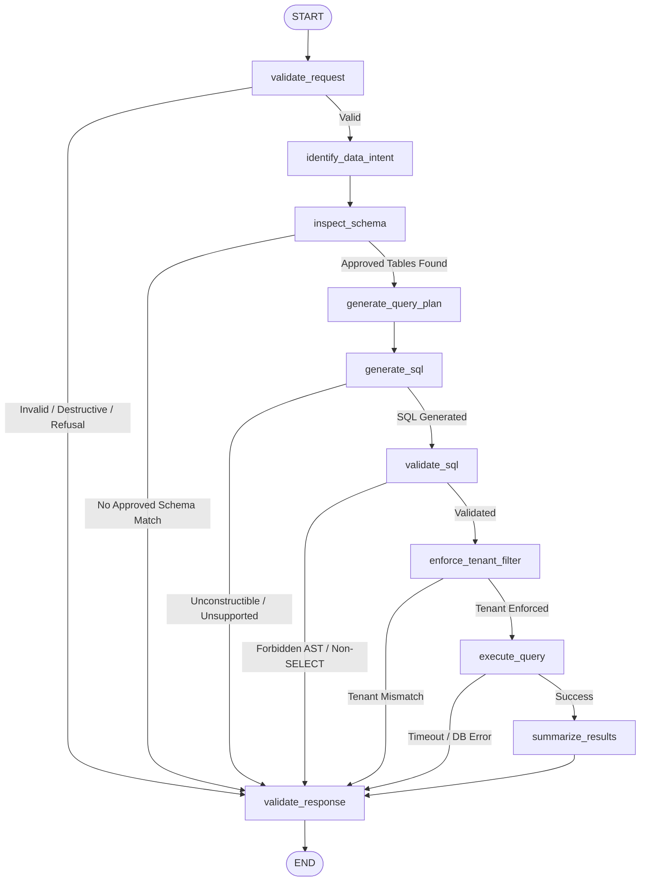

# OmniAgent AI — Database Agent Implementation Guide

## 1. Executive Summary & Purpose

The **Database Agent** is the specialized data intelligence AI employee of the OmniAgent AI enterprise platform. It enables operators, business analysts, and executives to query authorized business data using conversational natural language without exposing database credentials, risking SQL injection, or permitting cross-tenant data leakage.

The Database Agent operates under a strict **Zero-Trust Model**:
- The LLM is **never** granted raw connection strings, direct database access, or arbitrary SQL execution capabilities.
- Queries are strictly **read-only SELECT** operations. All DDL and data-modifying DML are unconditionally rejected.
- Every tenant query is filtered by the authenticated user's `organization_id` injected at the backend security layer.
- Only allowlisted tables and columns registered in the **Schema Registry** can be queried.

---

## 2. Architecture & LangGraph Workflow

The Database Agent is orchestrated as a compiled, stateful LangGraph state machine with dedicated single-responsibility nodes and deterministic fallback capabilities.



### Node Responsibilities

1. **`validate_request`**: Validates authenticated `user_id` and `organization_id`, checks inquiry bounds (<= 2000 chars), and intercepts destructive commands (`DELETE`, `DROP`, `TRUNCATE`, `ALTER`) returning a controlled read-only refusal without execution.
2. **`identify_data_intent`**: Classifies the business question into a structured intent (`COUNT`, `LIST`, `FILTER`, `AGGREGATION`, `GROUP_BY`, `SUM`, `AVERAGE`, `MIN_MAX`, `TREND`, `COMPARISON`, `RANKING`, `SEARCH`, `UNKNOWN`) without chain-of-thought exposure.
3. **`inspect_schema`**: Matches the user's intent against approved tables in the `SchemaRegistry`. If no match exists, exits with a controlled refusal.
4. **`generate_query_plan`**: Synthesizes a structured JSON query plan defining operations, tables, aggregations, filters, sort orders, and limits.
5. **`generate_sql`**: Produces a parameterized, read-only SQL query using verified templates or dynamic SQL generation, strictly binding literals to parameter dictionaries.
6. **`validate_sql`**: Performs deep multi-layer security validation ensuring no DDL/DML, no stacked statements, no dangerous PostgreSQL functions (`pg_read_file`, `pg_sleep`), and strict adherence to the table allowlist.
7. **`enforce_tenant_filter`**: Verifies that `organization_id = :organization_id` is present in the query and parameter dictionary, locking the query to the authenticated caller's tenant.
8. **`execute_query`**: Executes the parameterized statement via SQLAlchemy AsyncSession within an async timeout boundary (`DATABASE_AGENT_QUERY_TIMEOUT_SECONDS`) and bounded result limit (`DATABASE_AGENT_MAX_ROWS`).
9. **`summarize_results`**: Synthesizes a concise, non-hallucinatory summary grounded strictly and exclusively in the returned rows. If 0 rows are returned, provides a clear, polite notification.
10. **`validate_response`**: Sanitizes results, redacts any sensitive columns if accidentally retrieved, computes confidence scores, and prepares the final `DatabaseResponse`.

---

## 3. Database Access & Schema Registry

### Approved Tables Allowlist

| Table Name | Description | Key Allowed Columns |
| :--- | :--- | :--- |
| `orders` | Customer orders & sales status | `id`, `order_number`, `customer_name`, `status`, `total_amount`, `created_at` |
| `production_records` | Factory inspection & quality records | `id`, `machine_id`, `batch_number`, `status`, `defect_count`, `production_time_hours`, `created_at` |
| `machines` | Industrial equipment & failure history | `id`, `name`, `machine_code`, `department_id`, `status`, `failure_count`, `created_at` |
| `products` | Product catalog, pricing & usage | `id`, `name`, `sku`, `category`, `price`, `usage_count`, `is_active` |
| `vendors` | Suppliers & purchase volumes | `id`, `name`, `contact_email`, `total_purchases`, `rating` |
| `maintenance_requests` | Plant maintenance work tickets | `id`, `machine_id`, `title`, `status`, `priority`, `created_at` |
| `documents` | Enterprise document storage | `id`, `uploaded_by`, `file_name`, `file_type`, `file_size_bytes`, `processing_status` |
| `agent_runs` | Autonomous agent execution traces | `id`, `agent_name`, `task_description`, `status`, `latency_ms`, `total_tokens`, `cost_usd` |
| `approvals` | Governance approval requests | `id`, `action_type`, `risk_level`, `status`, `reason`, `created_at` |
| `workflows` | Configured automation workflows | `id`, `name`, `description`, `trigger_type`, `is_active` |
| `workflow_runs` | Workflow execution DAG instances | `id`, `workflow_id`, `status`, `started_at`, `finished_at` |
| `departments` | Organizational business units | `id`, `name`, `code`, `created_at` |
| `notifications` | System & task alert notices | `id`, `user_id`, `title`, `message`, `is_read`, `created_at` |

### Prohibited & Hidden Schema Elements

The Schema Registry strictly forbids and hides:
- User credentials and password hashes (`users.hashed_password`)
- API keys, OAuth tokens, and encrypted credentials (`integrations.config_encrypted`)
- System catalog tables (`pg_catalog.*`, `information_schema.*`, `pg_shadow`, `pg_authid`)
- Database connection strings, credentials, and passwords

---

## 4. Multi-Layer Security Architecture

### 1. Read-Only Guarantee
The agent blocks the following SQL operations at the AST and lexer levels:
```text
INSERT, UPDATE, DELETE, DROP, ALTER, TRUNCATE, CREATE, GRANT, REVOKE,
EXEC, EXECUTE, MERGE, CALL, COPY, REINDEX, VACUUM, INTO OUTFILE, INTO DUMPFILE
```

### 2. Multi-Tenant Isolation
Every tenant-owned table requires mandatory filtering:
```sql
SELECT COUNT(*) AS pending_orders_count
FROM orders
WHERE organization_id = :organization_id AND status = :status
```
The parameter `:organization_id` is derived from the JWT session claims, not the request body or user prompt. If a user attempts to supply an organization ID in the natural language question (e.g. *"Show records for org XYZ"*), the backend security validator binds the authenticated tenant ID instead.

### 3. SQL Injection Defense
- Literal string concatenation is strictly banned.
- All query arguments are parameterized using SQLAlchemy `:parameter_name` dictionaries.
- Semicolon-stacked queries (e.g. `SELECT * FROM orders; DROP TABLE users;`) are intercepted and rejected.
- SQL injection comment markers (`--`, `/* */`) are sanitized and validated.

### 4. Bounded Resource Limits & Timeouts
- **Default Maximum Rows**: `100` (configurable via `DATABASE_AGENT_MAX_ROWS`).
- **Hard Maximum Limit**: `500` (configurable via `DATABASE_AGENT_MAX_LIMIT`).
- **Query Timeout**: `10 seconds` (configurable via `DATABASE_AGENT_QUERY_TIMEOUT_SECONDS`).
Queries exceeding the timeout limit raise `QueryTimeoutError` and return a safe advisory to the user without crashing the API.

---

## 5. API Reference

### `POST /api/v1/agents/database/query`

Executes a natural language business query against authorized enterprise data.

#### Request Headers
```http
Authorization: Bearer <JWT_TOKEN>
Content-Type: application/json
```

#### Request Body
```json
{
  "question": "How many pending orders do we have?",
  "limit": 20
}
```

#### Successful Response (200 OK)
```json
{
  "success": true,
  "data": {
    "question": "How many pending orders do we have?",
    "summary": "There are 2 pending orders.",
    "columns": [
      "pending_orders_count"
    ],
    "rows": [
      {
        "pending_orders_count": 2
      }
    ],
    "row_count": 1,
    "query_executed": true,
    "confidence": 0.98,
    "limited": false,
    "error": null
  }
}
```

#### Empty Results Response (200 OK)
```json
{
  "success": true,
  "data": {
    "question": "Show failed inspections",
    "summary": "No matching records were found in the authorized business data.",
    "columns": ["id", "batch_number", "status"],
    "rows": [],
    "row_count": 0,
    "query_executed": true,
    "confidence": 0.92,
    "limited": false,
    "error": null
  }
}
```

#### Unsupported / Unapproved Data Response (200 OK)
```json
{
  "success": true,
  "data": {
    "question": "What is the secret salary of the CEO?",
    "summary": "The requested information is not available in the authorized business data.",
    "columns": [],
    "rows": [],
    "row_count": 0,
    "query_executed": false,
    "confidence": 0.0,
    "limited": false,
    "error": null
  }
}
```

#### Error Codes
- `401 Unauthorized`: Missing or invalid Bearer JWT token.
- `422 Unprocessable Entity`: Question empty or malformed request payload.

---

## 6. Supervisor Agent Integration

The **Supervisor Agent** routes natural-language business metric and operational data inquiries to the Database Agent:

```json
{
  "task_type": "DATABASE_QUERY",
  "selected_agent": "database_agent",
  "capability": "database_query",
  "requires_approval": false,
  "confidence": 0.96
}
```

The Supervisor Agent **never** generates SQL. It delegates the operational task plan to the Database Agent, which owns schema discovery, plan generation, SQL security validation, and execution.

---

## 7. Verification & Test Suite Summary

The test suite provides comprehensive coverage across unit, security, and integration layers without requiring paid external LLM APIs:

1. **Unit Tests (`tests/unit/agents/test_database_agent.py`)**:
   - Valid queries: Pending orders, failed inspections, machine failure rankings, average production time.
   - Read-only integrity: Rejection of DELETE, DROP, UPDATE, INSERT, ALTER, TRUNCATE, GRANT, REVOKE, EXEC.
   - Stacked query blocking and dangerous function execution blocking.
   - Empty results handling and zero-row notifications.
   - Result limit enforcement and timeout boundary recovery.
2. **Security Tests (`tests/security/agents/test_database_security.py`)**:
   - Cross-tenant access attempts: Organization A querying Organization B data is strictly blocked.
   - Parameter tampering and SQL injection prevention.
   - System catalog intrusion attempts blocked.
   - Adversarial prompt injection attacks safely rejected.
3. **Integration & API Tests (`tests/integration/api/test_database_api.py`)**:
   - Unauthorized access rejection (HTTP 401).
   - Authenticated query execution returning structured JSON envelope.
   - Supervisor Agent routing to Database Agent verification.
4. **Full Regression Run**:
   - 150 passed tests across the entire repository with zero failures.

---

## 8. Known Limitations & Next Steps

- **Read-Only Scope**: The Database Agent is strictly read-only. Data modifications (e.g. cancel order, approve purchase) will be handled by the **Action Agent** with Human-in-the-Loop approval workflows.
- **Complex Multi-Table Joins**: Highly ambiguous natural language queries requiring multi-table joins without explicit foreign key hints are safely refused rather than risking hallucinated SQL joins.
- **Recommended Next Agent**: **Reasoning Agent** (for multi-step analytical reasoning and report generation combining document, knowledge, and database telemetry).
