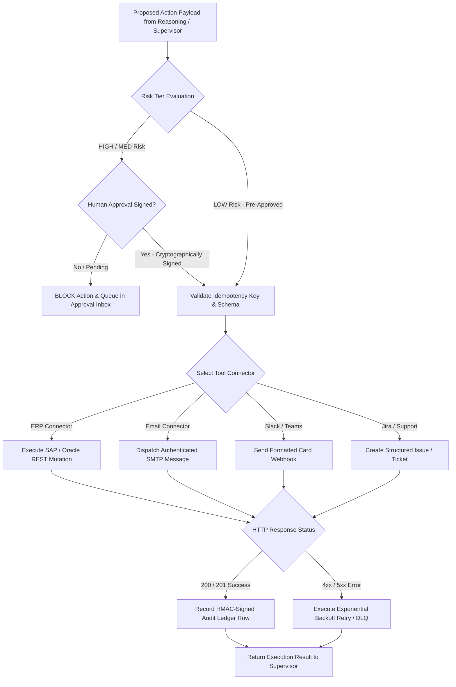

# Agent — Action Agent Specification

## Status
**Status:** ✅ IMPLEMENTED (External API Mutations & Tool Execution)

---

## 1. Overview & Purpose

The **Action Agent** is the operational actuator of OmniAgent AI. While other agents focus on ingestion, extraction, retrieval, and reasoning, the Action Agent is the only agent authorized to execute real-world side effects—such as creating tickets in Jira/ServiceNow, posting journal entries in ERPs, dispatching emails via SMTP, sending Slack webhooks, and updating relational database states. It enforces cryptographic authorization, idempotency keys, and strict schema validation before executing any mutation.



---

## 2. Technical Specification

| Field | Detail |
| :--- | :--- |
| **Agent Class** | `app.agents.action.ActionAgent` |
| **Model Routing** | Deterministic Tool Runner (Python Execution Engine) + Structured LLM Formatter |
| **Inputs** | Target tool name, validated parameter dictionary, idempotency UUID, human approval token. |
| **Outputs** | Mutation receipt, HTTP status code, external entity IDs (e.g., ticket number), execution latency. |
| **Core Responsibilities**| 1. Parameter schema validation against Pydantic tool definitions.<br>2. Human approval token verification.<br>3. Idempotent API mutation dispatching.<br>4. Automatic retry with exponential backoff on network failures.<br>5. Tamper-evident audit logging. |
| **Tools & Subsystems** | `erp_api_tool`, `smtp_mail_tool`, `slack_webhook_tool`, `jira_ticket_tool`, `audit_signer`. |
| **Dependencies** | `httpx` (async HTTP client), Pydantic v2, cryptography (HMAC SHA-256). |
| **Failure Handling** | Catches rate limits and transient 502/503 errors; retries with exponential jitter (max 3 attempts); if permanent 4xx error occurs, rolls back transaction and notifies supervisor. |
| **Security Controls** | **Strictly sandboxed credentials**; requires valid human approval digital signature for HIGH risk tools; prevents SSRF via IP allowlists. |

---

## 3. Concrete Example: ERP Invoice Posting

### Inbound Approved Action Request
```json
{
  "action": "erp.post_invoice",
  "idempotency_key": "idem_89a01f44-9912-42da-91bb-bc842910fa31",
  "approval_token": "sig_eyJhbGciOiJIUzI1NiIsInR5cCI6IkpXVCJ9...",
  "parameters": {
    "invoice_number": "INV-2026-8812",
    "vendor_id": "VEND-APEX-01",
    "amount": 14250.00,
    "currency": "USD",
    "po_reference": "PO-9014",
    "gl_account": "2100-ACCOUNTS-PAYABLE"
  }
}
```

### Action Agent Execution Result
```json
{
  "status": "MUTATION_SUCCESS",
  "external_system": "SAP_S4HANA_REST_API",
  "http_status": 201,
  "external_id": "SAP-DOC-2026-099412",
  "timestamp": "2026-08-15T14:35:12.190Z",
  "latency_ms": 284,
  "audit_record_id": "audit_log_991823",
  "message": "Invoice INV-2026-8812 successfully posted to SAP General Ledger under Document #SAP-DOC-2026-099412."
}
```
