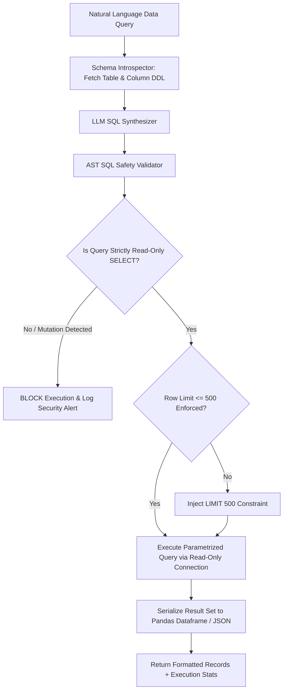

# Agent — Database Agent Specification

## Status
**Status:** ✅ IMPLEMENTED (Parametrized Read-Only SQL & Schema Introspection)

---

## 1. Overview & Purpose

The **Database Agent** is the structured enterprise data specialist of OmniAgent AI. It allows the system to query internal relational data warehouses and transactional databases (PostgreSQL, MySQL, SQL Server) using natural language. It introspects schema metadata, synthesizes AST-validated, read-only SQL queries, executes queries within resource-bounded sandboxes, and formats tabular results for downstream agent synthesis.



---

## 2. Technical Specification

| Field | Detail |
| :--- | :--- |
| **Agent Class** | `app.agents.database.DatabaseAgent` |
| **Model Routing** | Claude 3.5 Sonnet / GPT-4o / Qwen 2.5 Coder |
| **Inputs** | Natural language inquiry, target database connection key, tenant ID context. |
| **Outputs** | Structured tabular JSON, column types, generated SQL string, row count, execution time. |
| **Core Responsibilities**| 1. Dynamic database schema introspection.<br>2. Text-to-SQL generation with table join synthesis.<br>3. AST security validation and forbidden keyword blocking.<br>4. Result serialization and statistical summarization. |
| **Tools & Subsystems** | `schema_inspector_tool`, `sql_ast_validator`, `readonly_sql_executor`, `tabular_formatter`. |
| **Dependencies** | `sqlparse`, SQLAlchemy 2.0 Async, Pandas, asyncpg. |
| **Failure Handling** | If SQL execution errors with syntax or unknown column, captures database error message and triggers auto-correction loop (max 3 retries). |
| **Security Controls** | **Strictly read-only user credentials**; AST parser blocks all DDL (`CREATE`, `DROP`, `ALTER`) and DML mutations (`INSERT`, `UPDATE`, `DELETE`, `TRUNCATE`); mandatory `LIMIT` enforcement. |

---

## 3. Concrete Example: SQL Synthesis

### Natural Language Prompt
> *"Show me all open purchase orders for vendor 'Apex Precision' created in the last 30 days exceeding $5,000."*

### Synthesized Validated SQL
```sql
SELECT 
    po.id AS po_number,
    po.vendor_name,
    po.total_amount,
    po.status,
    po.created_at
FROM purchase_orders po
WHERE po.tenant_id = :tenant_id
  AND LOWER(po.vendor_name) LIKE '%apex precision%'
  AND po.status = 'OPEN'
  AND po.total_amount > 5000.00
  AND po.created_at >= NOW() - INTERVAL '30 days'
ORDER BY po.created_at DESC
LIMIT 50;
```

### Agent Output Response
```json
{
  "status": "SUCCESS",
  "query_executed": "SELECT po.id AS po_number, po.vendor_name, po.total_amount, po.status, po.created_at FROM purchase_orders po WHERE po.tenant_id = :tenant_id AND LOWER(po.vendor_name) LIKE '%apex precision%' AND po.status = 'OPEN' AND po.total_amount > 5000.00 AND po.created_at >= NOW() - INTERVAL '30 days' ORDER BY po.created_at DESC LIMIT 50;",
  "row_count": 2,
  "execution_time_ms": 38.4,
  "data": [
    {
      "po_number": "PO-9014",
      "vendor_name": "Apex Precision Components",
      "total_amount": 14250.00,
      "status": "OPEN",
      "created_at": "2026-08-10T14:22:00Z"
    },
    {
      "po_number": "PO-8922",
      "vendor_name": "Apex Precision Components",
      "total_amount": 6800.00,
      "status": "OPEN",
      "created_at": "2026-08-01T09:15:00Z"
    }
  ]
}
```
