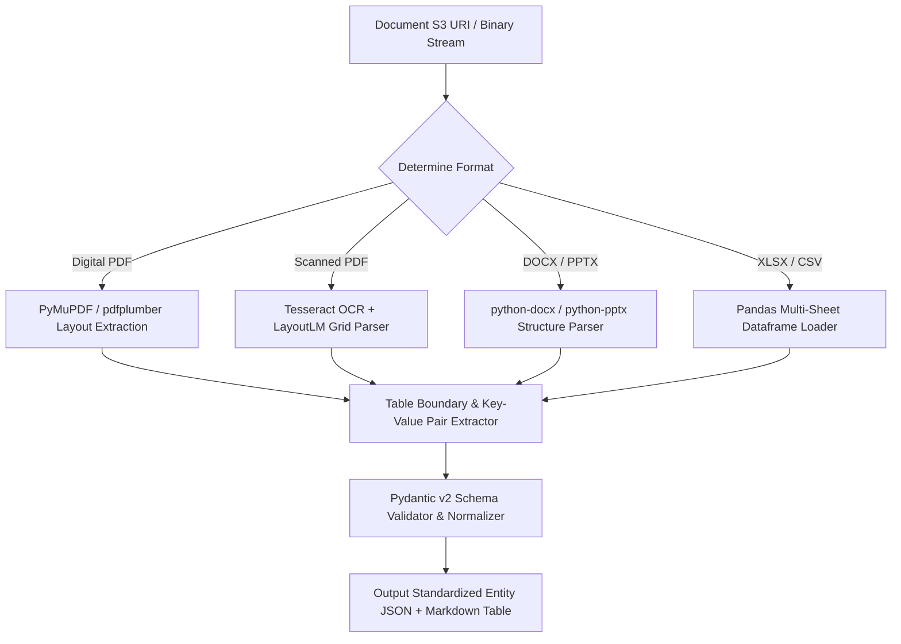

# Agent — Document Agent Specification

## Status
**Status:** ✅ IMPLEMENTED (Document Parsing & Structured JSON Extraction)

---

## 1. Overview & Purpose

The **Document Agent** is specialized in the high-fidelity structural extraction and semantic understanding of semi-structured and unstructured enterprise documents, including multi-page PDF contracts, vendor invoices, financial balance sheets, Word documents (`.docx`), presentations (`.pptx`), and Excel/CSV spreadsheets. It converts complex nested visual layouts, tabular grids, and header hierarchies into standardized Pydantic JSON schemas.



---

## 2. Technical Specification

| Field | Detail |
| :--- | :--- |
| **Agent Class** | `app.agents.document.DocumentAgent` |
| **Model Routing** | Claude 3.5 Sonnet / GPT-4o / Local Mistral Nemo |
| **Inputs** | Document S3 Key, document MIME type, target extraction schema (e.g., `InvoiceSchema`, `ContractTermsSchema`). |
| **Outputs** | Validated Pydantic JSON object, extracted text blocks, Markdown tables, extraction confidence scores. |
| **Core Responsibilities**| 1. High-fidelity table and grid extraction.<br>2. Key-value entity extraction (PO numbers, totals, tax IDs, due dates).<br>3. Multi-page document merging and cross-page table reconstruction.<br>4. Multi-sheet spreadsheet formula and aggregation processing. |
| **Tools & Subsystems** | `pymupdf_extractor`, `table_grid_parser`, `schema_validator_tool`, `pandas_calc_tool`. |
| **Dependencies** | PyMuPDF (fitz), pdfplumber, openpyxl, pandas, python-docx, pydantic. |
| **Failure Handling** | If digital extraction yields low character density (< 50 chars/page), automatically triggers OCR fallback; repairs truncated JSON via recursive schema validator. |
| **Security Controls** | Sandboxed PDF parser preventing embedded JavaScript execution or malicious font decompression exploits. |

---

## 3. Concrete Example: Invoice Extraction

### Extracted Structured Output
```json
{
  "document_type": "commercial_invoice",
  "document_id": "INV-2026-9901",
  "vendor": {
    "name": "Global Tech Logistics Ltd",
    "tax_id": "US-EIN-99210041",
    "address": "404 Industrial Pkwy, Austin, TX 78701"
  },
  "customer": {
    "name": "Acme Enterprise Corp",
    "po_number": "PO-2026-8812"
  },
  "invoice_date": "2026-08-15",
  "payment_due_date": "2026-09-15",
  "line_items": [
    {
      "item_number": 1,
      "sku": "SRV-RACK-42U",
      "description": "42U Server Rack Enclosure",
      "quantity": 4,
      "unit_price": 850.00,
      "total_price": 3400.00
    },
    {
      "item_number": 2,
      "sku": "PDU-30A-01",
      "description": "30A Monitored PDU Unit",
      "quantity": 8,
      "unit_price": 220.00,
      "total_price": 1760.00
    }
  ],
  "subtotal": 5160.00,
  "tax_amount": 412.80,
  "total_amount": 5572.80,
  "currency": "USD",
  "confidence_score": 0.992
}
```
