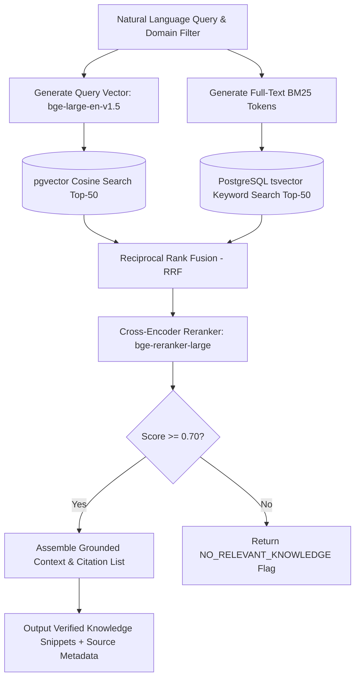

# Agent — RAG Agent Specification

## Status
**Status:** ✅ IMPLEMENTED (Enterprise Knowledge Retrieval & Grounding)

---

## 1. Overview & Purpose

The **RAG Agent** is the enterprise knowledge specialist of OmniAgent AI. It acts as the gateway to the organization's indexed knowledge repositories (standard operating procedures, HR policy handbooks, compliance manuals, technical runbooks, and historical support records). It performs multi-stage hybrid search, reranking, source citation assembly, and factual groundedness verification.



---

## 2. Technical Specification

| Field | Detail |
| :--- | :--- |
| **Agent Class** | `app.agents.rag.RAGAgent` |
| **Model Routing** | BAAI/bge-large-en-v1.5 (Embeddings) + bge-reranker-large (Reranker) + Claude 3.5 Sonnet |
| **Inputs** | Natural language question, optional document category filter, tenant ID, user access role. |
| **Outputs** | List of cited factual passages, similarity scores, document IDs, page numbers, synthesized summary. |
| **Core Responsibilities**| 1. Query embedding and BM25 tokenization.<br>2. Hybrid vector and full-text retrieval execution.<br>3. Cross-Encoder reranking.<br>4. Multi-tenant document isolation and permission filtering.<br>5. Extraction of precise page/section citations. |
| **Tools & Subsystems** | `vector_search_tool`, `keyword_search_tool`, `rerank_tool`, `citation_builder`. |
| **Dependencies** | `pgvector`, SQLAlchemy 2.0 Async, PyTorch / HuggingFace Transformers, LangChain. |
| **Failure Handling** | If vector search returns zero results above threshold, falls back to broadened keyword search; if still empty, explicitly flags lack of knowledge rather than guessing. |
| **Security Controls** | Enforces row-level security (RLS) and tenant workspace ID filtering on every single vector query. |

---

## 3. Concrete Example: Policy Lookup

### Input Task
```json
{
  "query": "What is the maximum reimbursement allowance for international flight business travel and which cabin class is permitted?",
  "category": "travel_and_expense_policy"
}
```

### Agent Output Response
```json
{
  "status": "SUCCESS",
  "citations": [
    {
      "source_document": "Global_Travel_Policy_2026.pdf",
      "document_id": "doc_99182",
      "page_number": 14,
      "section": "Section 3.2 - Air Travel Class Eligibility",
      "relevance_score": 0.942,
      "text_snippet": "For international flights exceeding 6 consecutive hours in duration, employees at Manager level and above are eligible for Business Class booking. Maximum daily lodging and incidental cap is $350 USD per diem."
    }
  ],
  "synthesized_answer": "According to Section 3.2 of the Global Travel Policy (p. 14), Business Class is permitted for international flights exceeding 6 consecutive hours for employees at Manager level and above. The daily incidental and lodging cap is $350 USD."
}
```
