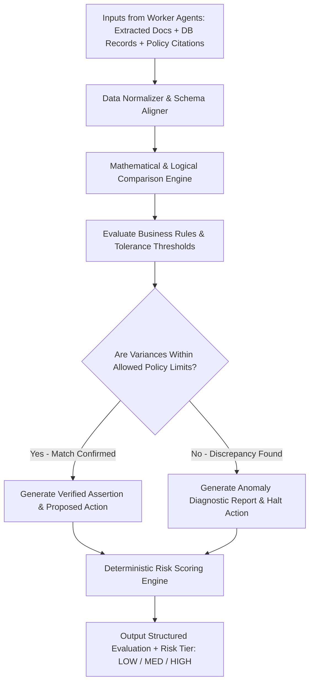

# Agent — Reasoning Agent Specification

## Status
**Status:** ✅ IMPLEMENTED (Multi-Step Logic, Policy Evaluation & Discrepancy Analysis)

---

## 1. Overview & Purpose

The **Reasoning Agent** is the cognitive evaluation engine of OmniAgent AI. It synthesizes disparate data streams produced by the Vision, Document, RAG, and Database agents. Its primary responsibility is to execute deterministic business rules, evaluate multi-way reconciliations (e.g., 3-Way Invoice Matching), calculate mathematical variances, verify compliance against organizational policies, and assign a calculated **Risk Score** to proposed downstream actions.



---

## 2. Technical Specification

| Field | Detail |
| :--- | :--- |
| **Agent Class** | `app.agents.reasoning.ReasoningAgent` |
| **Model Routing** | Claude 3.5 Sonnet / OpenAI o1-mini / GPT-4o |
| **Inputs** | Extracted document JSON, relational query results, RAG policy snippets, tolerance thresholds. |
| **Outputs** | Structured evaluation report, discrepancy itemization, compliance verdict, action proposal, risk tier. |
| **Core Responsibilities**| 1. Multi-way mathematical and line-item matching.<br>2. Policy assertion verification.<br>3. Anomaly and fraud indicator detection.<br>4. Risk classification (LOW, MEDIUM, HIGH) for Human-in-the-Loop gating. |
| **Tools & Subsystems** | `diff_analyzer_tool`, `math_verifier_tool`, `risk_scorer_tool`, `policy_compliance_checker`. |
| **Dependencies** | Pydantic v2, Python Decimal (precision arithmetic), LangChain Core. |
| **Failure Handling** | If numerical inputs contain unit mismatches or missing values, isolates the ambiguous fields and marks evaluation as `INCONCLUSIVE_REQUIRES_OPERATOR`. |
| **Security Controls** | Enforces deterministic rule constraints over LLM outputs; mathematical calculations are computed via native Python Decimal rather than LLM text generation. |

---

## 3. Concrete Example: 3-Way Invoice Match Evaluation

### Evaluation Output JSON
```json
{
  "evaluation_type": "3_way_invoice_match",
  "match_status": "MATCH_CONFIRMED",
  "overall_variance_percentage": 0.00,
  "reconciliation_summary": {
    "invoice_total": 14250.00,
    "po_total": 14250.00,
    "goods_received_total": 14250.00,
    "currency": "USD"
  },
  "line_item_breakdown": [
    {
      "sku": "SRV-RACK-42U",
      "invoice_qty": 4,
      "po_qty": 4,
      "gr_qty": 4,
      "invoice_unit_price": 850.00,
      "po_unit_price": 850.00,
      "variance": 0.00,
      "status": "EXACT_MATCH"
    }
  ],
  "policy_assertions": [
    {
      "rule": "Vendor must match approved vendor list",
      "result": "PASS"
    },
    {
      "rule": "Invoice total within PO authorized ceiling",
      "result": "PASS"
    }
  ],
  "proposed_action": {
    "action_name": "erp.post_invoice_payment",
    "parameters": {
      "invoice_id": "INV-2026-8812",
      "po_number": "PO-9014",
      "amount": 14250.00
    }
  },
  "risk_assessment": {
    "risk_level": "HIGH",
    "risk_factors": ["Total amount exceeds $10,000 threshold"],
    "requires_human_approval": true,
    "required_approver_role": "finance_manager"
  }
}
```
