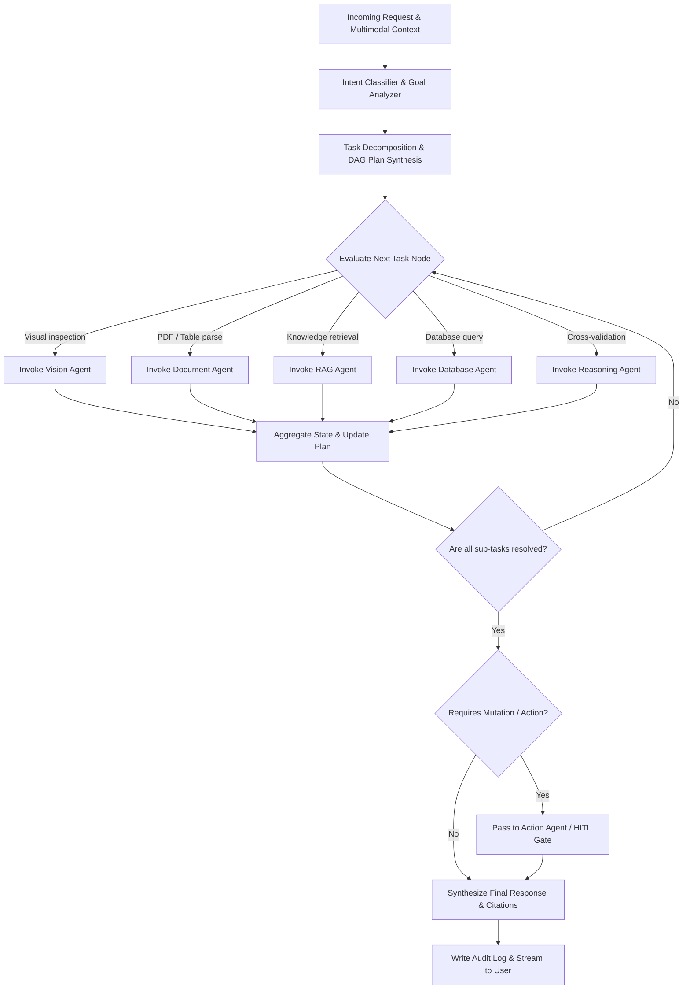

# Agent — Supervisor Agent Specification

## Status
**Status:** ✅ IMPLEMENTED (LangGraph Central Controller)

---

## 1. Overview & Purpose

The **Supervisor Agent** is the master cognitive orchestrator of OmniAgent AI. Implemented as the root node of the LangGraph state machine, it analyzes the incoming natural language request and attached multimodal artifacts, decomposes complex enterprise goals into an execution plan (DAG), delegates sub-tasks to specialized worker agents, tracks state transitions, and synthesizes the final verified response.



---

## 2. Technical Specification

| Field | Detail |
| :--- | :--- |
| **Agent Class** | `app.agents.supervisor.SupervisorAgent` |
| **Model Routing** | Claude 3.5 Sonnet (Default High-Reasoning) / GPT-4o / Local Llama 3.3 70B |
| **Inputs** | User prompt, conversation history, S3 artifact URIs, workspace tenant metadata. |
| **Outputs** | Structured LangGraph task dispatch (`next_agent`, `agent_payload`), final synthesized answer. |
| **Core Responsibilities**| 1. Intent classification.<br>2. Dynamic task planning and DAG management.<br>3. Worker agent lifecycle management.<br>4. Result aggregation and conversational memory synthesis. |
| **Tools & Subsystems** | `router_tool`, `plan_synthesizer`, `state_checkpointer`, `audit_recorder`. |
| **Dependencies** | LangGraph, LangChain Core, Redis Session Checkpointer, Pydantic v2. |
| **Failure Handling** | Retries failed sub-agent tasks up to 3 times with refined instructions; gracefully falls back to interactive clarification if input is ambiguous. |
| **Security Controls** | Strips executable syntax from user input; enforces tenant context isolation across all delegated worker payloads. |

---

## 3. End-to-End Execution Example

### User Query
> *"Verify invoice INV-2026-8812 attached, compare it against Purchase Order PO-9014 in our ERP database, and if the line item totals match our vendor agreement, queue it for manager payment approval."*

### Supervisor Task Decomposition
```json
{
  "plan_id": "plan_99214",
  "goal": "Verify invoice INV-2026-8812 and queue payment approval",
  "tasks": [
    {
      "task_id": "task_1",
      "agent": "document_agent",
      "instruction": "Extract structured line items, vendor name, tax, and total from S3 document invoice_8812.pdf"
    },
    {
      "task_id": "task_2",
      "agent": "database_agent",
      "instruction": "Query ERP database for purchase order 'PO-9014' and vendor agreement terms"
    },
    {
      "task_id": "task_3",
      "agent": "reasoning_agent",
      "instruction": "Perform 3-way line item match and calculate variance between task_1 and task_2 outputs"
    },
    {
      "task_id": "task_4",
      "agent": "action_agent",
      "instruction": "If reasoning confirms match, create HIGH RISK human approval request for invoice payment"
    }
  ]
}
```
