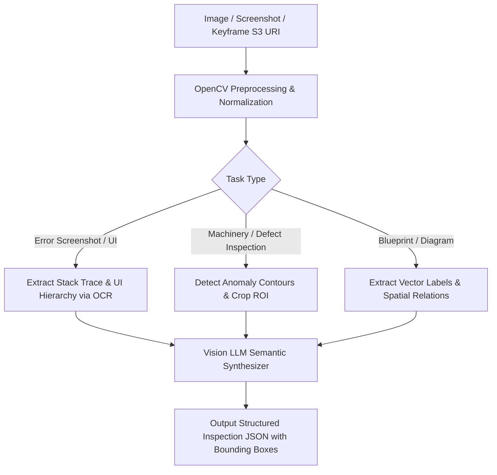

# Agent — Vision Agent Specification

## Status
**Status:** ✅ IMPLEMENTED (Computer Vision & Visual LLM Analysis)

---

## 1. Overview & Purpose

The **Vision Agent** is specialized in visual analysis of enterprise visual artifacts—including factory machine inspection photos, printed circuit boards (PCBs), UI application error screenshots, architectural blueprints, and scanned diagrammatic forms. It combines deterministic computer vision algorithms (OpenCV preprocessing, contour detection, noise suppression) with multimodal LLMs to identify anomalies, transcribe unformatted visual text via OCR, and return localized bounding boxes.



---

## 2. Technical Specification

| Field | Detail |
| :--- | :--- |
| **Agent Class** | `app.agents.vision.VisionAgent` |
| **Model Routing** | GPT-4o Vision / Claude 3.5 Sonnet / Local Qwen2-VL / Llama 3.2 Vision |
| **Inputs** | Image S3 Key, image MIME type, analysis objective, optional region-of-interest coordinates. |
| **Outputs** | Structured JSON with detected objects, bounding boxes `[ymin, xmin, ymax, xmax]`, anomaly labels, confidence score. |
| **Core Responsibilities**| 1. Image preprocessing and contrast normalization.<br>2. OCR extraction of visual stack traces and UI dialogs.<br>3. Industrial surface defect and hardware wear detection.<br>4. Visual diagram and schematic transcription. |
| **Tools & Subsystems** | `opencv_preprocessor`, `tesseract_ocr_tool`, `bounding_box_annotator`, `crop_roi_tool`. |
| **Dependencies** | OpenCV (`cv2`), Pillow, Tesseract OCR, PyPdfplumber, LangChain Multimodal Messages. |
| **Failure Handling** | If image resolution is too low or degraded, applies adaptive histogram equalization (CLAHE) and retries; if unreadable, returns structured low-confidence warning. |
| **Security Controls** | Strips EXIF metadata to prevent geolocation leakage; validates image magic headers against steganographic code execution payloads. |

---

## 3. Concrete Example: Machine Defect Inspection

### Input Task
```json
{
  "task": "inspect_defect",
  "image_uri": "s3://omni-artifacts/inspect/turbine_blade_04.png",
  "component_type": "high_pressure_turbine_blade"
}
```

### Agent Output Response
```json
{
  "status": "ANOMALY_DETECTED",
  "defect_type": "surface_pitting_corrosion",
  "severity": "CRITICAL",
  "confidence": 0.964,
  "bounding_box": {
    "ymin": 420,
    "xmin": 180,
    "ymax": 510,
    "xmax": 290
  },
  "dimensions_mm": {
    "estimated_width": 4.2,
    "estimated_depth": 0.8
  },
  "description": "Localized pitting corrosion detected along leading edge of turbine blade. Exceeds standard tolerance of 0.2mm depth.",
  "recommended_action": "Quarantine blade for ultrasonic non-destructive evaluation."
}
```
