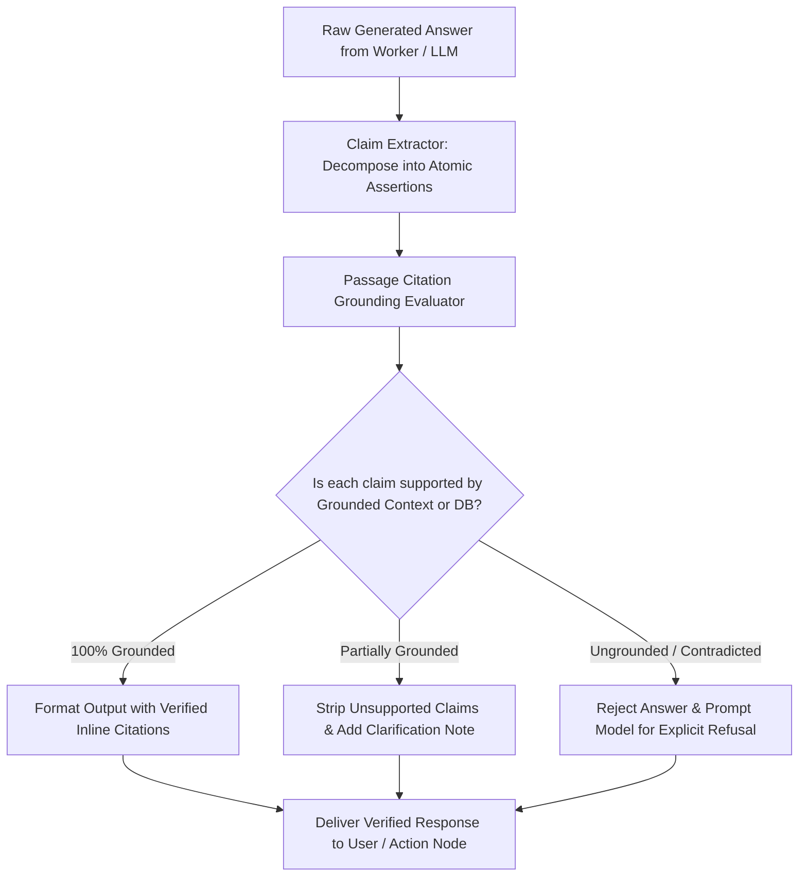

# AI Subsystems — Hallucination Control & Grounding Verification

## Status
**Status:** ✅ IMPLEMENTED (Two-Pass Fact Grounding & Citation Validation)

---

## 1. Zero-Tolerance Grounding Strategy

In enterprise workflows, an AI hallucinating an incorrect financial total, inventory quantity, or policy standard can cause catastrophic operational errors. OmniAgent AI enforces strict **Hallucination Control** through a dual-pass verification pipeline and source attribution requirements.



---

## 2. Hallucination Prevention Guardrails

| Guardrail | Mechanism | Implementation Detail |
| :--- | :--- | :--- |
| **Strict Boundary Prompts** | System Prompt Constraints | Prompts explicitly forbid external guessing and mandate explicit refusal when context is missing. |
| **Atomic Claim Verification** | Self-Checking LLM Pass | Decomposes complex answers into atomic subject-predicate-object claims and verifies each against retrieved chunks. |
| **Mandatory Citation Indexing** | Citation Builder | Every sentence stating a policy rule or metric must include a valid reference token `[doc_id:page]`. |
| **Mathematical Precision** | Python Decimal Sandbox | Prevents LLM arithmetic hallucinations; all totals, taxes, and variances are calculated in Python. |
| **Structured Output Schemas** | Pydantic v2 Types | Forces model outputs into strictly typed JSON rather than free-form prose. |

---

## 3. Explicit Refusal Protocol

When enterprise documents do not contain sufficient evidence to answer an operational inquiry, OmniAgent AI explicitly responds with structured refusal rather than speculative generation:

```markdown
> ⚠️ **Verification Notice:** The enterprise knowledge base does not contain active policy guidelines regarding "reimbursement for personal vehicle charging stations". 
> Please refer to the HR Global Handbook (2026) Section 8 or contact the People Operations desk.
```
