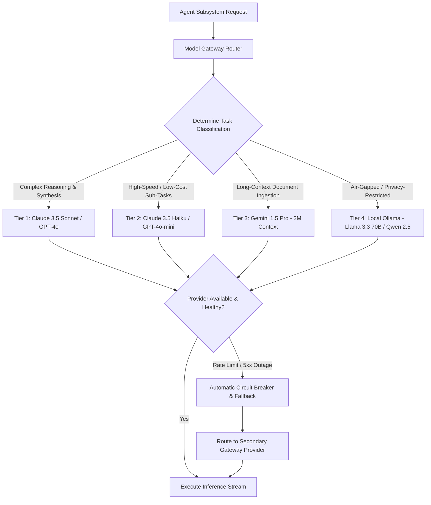

# AI Subsystems — Multi-Model Gateway & LLM Architecture

## Status
**Status:** ✅ IMPLEMENTED (Dynamic Model Routing & Fallback Gateway)

---

## 1. Overview & Multi-Model Strategy

OmniAgent AI avoids vendor lock-in by implementing an abstraction gateway that dynamically routes requests to the optimal foundation model based on task complexity, modality, context window requirements, data sovereignty policies, and latency budgets.

---

## 2. Model Routing Matrix

| Tier | Target Workloads | Primary Model | Fallback Model | Token Context |
| :--- | :--- | :--- | :--- | :--- |
| **Tier 1 (High Reasoning)** | Supervisor Planning, Reasoning Agent, Discrepancy Matching | Anthropic Claude 3.5 Sonnet | OpenAI GPT-4o | 200,000 / 128,000 |
| **Tier 2 (Fast Routing)** | Intent Classification, Entity Mapping, Simple Summaries | Anthropic Claude 3.5 Haiku | OpenAI GPT-4o-mini | 200,000 / 128,000 |
| **Tier 3 (Ultra-Long Context)**| Massive Multi-File RAG Ingestion, Full Financial Portfolios | Google Gemini 1.5 Pro | Claude 3.5 Sonnet | 2,000,000 |
| **Tier 4 (Self-Hosted / Local)**| Strict Air-Gapped / Offline On-Premises Deployments | Ollama Llama 3.3 70B | Ollama Mistral Nemo | 128,000 / 32,000 |

---

## 3. Resilience & Circuit Breaker Specification

* **Exponential Backoff:** Retries 429 (Rate Limit) and 503 (Overloaded) with jittered backoff ($1s, 2s, 4s$).
* **Circuit Breaker:** If a provider fails 5 consecutive times within a 60-second sliding window, trips open for 120 seconds and diverts all traffic to the fallback model.
* **Token Usage Metering:** Tracks prompt tokens, completion tokens, and estimated USD cost per tenant in PostgreSQL.
