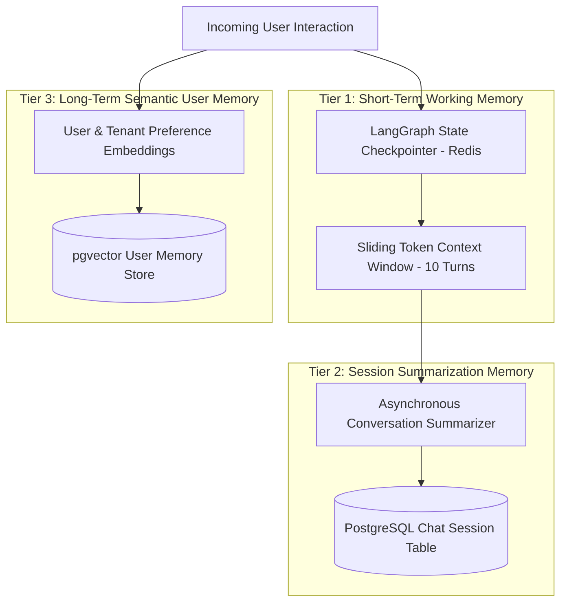

# AI Subsystems — Multi-Tiered Memory Architecture

## Status
**Status:** ✅ IMPLEMENTED (Short-Term & Working Memory) | 🚧 PARTIALLY IMPLEMENTED (Long-Term Semantic Memory)

---

## 1. Memory Tier Overview

OmniAgent AI deploys a three-tiered memory architecture that maintains conversation continuity, agent state scratchpads, and persistent cross-session enterprise knowledge.

---

## 2. Memory Specifications

| Memory Tier | Storage Backend | Retention Period | Data Structure | Purpose |
| :--- | :--- | :--- | :--- | :--- |
| **Tier 1: Working Memory** | Redis 7+ | Active Session (24 hrs) | JSON State Checkpoint | Tracks active sub-task DAG, agent scratchpad, and pending tool payloads. |
| **Tier 2: Session History**| PostgreSQL 16 | 90 Days / Configurable | Relational `chat_messages` | Full conversational log with role tags (`user`, `assistant`, `tool`). |
| **Tier 3: Long-Term Semantic**| pgvector Table | Permanent | 1024-dim Vector + JSONB | User custom preferences, frequently used GL account codes, and organization terms. |

---

## 3. Sliding Window & Summarization Buffer

When conversational history exceeds the maximum working token window (e.g., > 12,000 tokens):
1. A background LLM summarizes the oldest 60% of conversation turns into an executive summary bullet list.
2. The active context window retains the compact summary plus the most recent 5 raw user/assistant turns.
3. This guarantees constant context size and prevents token bloat and context drift.
