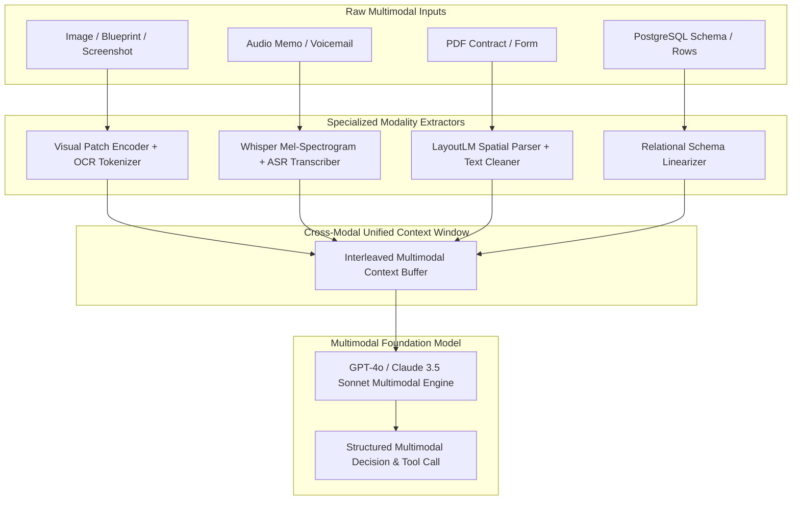

# AI Subsystems — Multimodal AI Reasoning & Alignment

## Status
**Status:** ✅ IMPLEMENTED (Vision-Language Alignment & Cross-Modal Fusion)

---

## 1. Cross-Modal Alignment Architecture

OmniAgent AI does not simply perform disjointed OCR or audio transcription; it implements unified **Cross-Modal Alignment**, enabling the AI to reason jointly across visual diagrams, tabular numbers, transcribed audio logs, and relational database records.

---

## 2. Core Cross-Modal Reasoning Patterns

### 1. Visual-Spatial Grounding
* Analyzes pixel coordinates relative to document layout to associate table headers with corresponding cell values even in borderless grids.
* Identifies visual arrows, flowcharts, and circuit schematics and maps them to directional dependency graphs.

### 2. Audio-Visual Correlation
* Aligns timestamped audio transcripts (e.g., a field technician explaining *"This valve on unit 4 is leaking oil"*) with corresponding photos or video frames taken at that exact timestamp.

### 3. Visual-Relational Verification
* Extracts text from physical barcodes, serial number tags, or shipping labels in photos and performs instantaneous foreign-key lookups against relational inventory databases.
