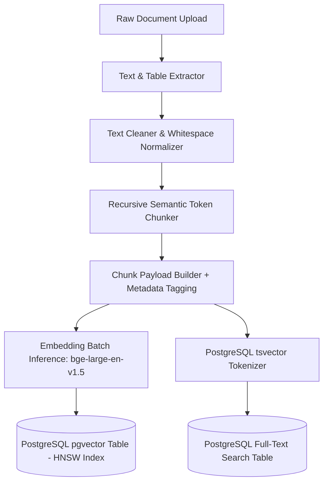

# AI Subsystems — RAG Ingestion & Indexing Pipeline

## Status
**Status:** ✅ IMPLEMENTED (End-to-End Hybrid Indexing with pgvector)

---

## 1. Document Ingestion & Vector Indexing Architecture

The RAG pipeline transforms heterogeneous enterprise documents into optimized vector embeddings and keyword indexes stored in PostgreSQL 16.



---

## 2. Ingestion Pipeline Stages

### 1. Document Extraction & Normalization
* Digital PDFs parsed with `fitz` (PyMuPDF); tables converted to structured Markdown format.
* OCR applied via Tesseract for scanned bitmap documents.
* Non-printable characters, broken hyphenations, and duplicate whitespace stripped.

### 2. Recursive Semantic Token Chunking
* **Chunk Window:** 512–1,024 tokens.
* **Overlap:** 10% (50–100 tokens).
* **Chunk Separators Hierarchy:** `["\n\n## ", "\n\n### ", "\n\n", "\n", ". ", " "]`.
* Preserves paragraph semantics and prevents breaking code blocks or tables across arbitrary character limits.

### 3. Vector Embeddings Generation
* Embeddings generated using `BAAI/bge-large-en-v1.5` producing 1024-dimensional dense vectors normalized with $L_2$ norm.
* Batched in groups of 64 chunks to maximize GPU/CPU inference throughput.

### 4. Database Persistence & HNSW Indexing
```sql
CREATE TABLE document_chunks (
    id UUID PRIMARY KEY DEFAULT gen_random_uuid(),
    tenant_id UUID NOT NULL,
    document_id UUID NOT NULL REFERENCES documents(id) ON DELETE CASCADE,
    chunk_index INT NOT NULL,
    content TEXT NOT NULL,
    tsv_content tsvector GENERATED ALWAYS AS (to_tsvector('english', content)) STORED,
    embedding vector(1024) NOT NULL,
    metadata JSONB NOT NULL DEFAULT '{}'::jsonb,
    created_at TIMESTAMP WITH TIME ZONE DEFAULT NOW()
);

CREATE INDEX idx_chunks_hnsw ON document_chunks 
USING hnsw (embedding vector_cosine_ops) 
WITH (m = 16, ef_construction = 64);

CREATE INDEX idx_chunks_tsv ON document_chunks USING gin (tsv_content);
```
