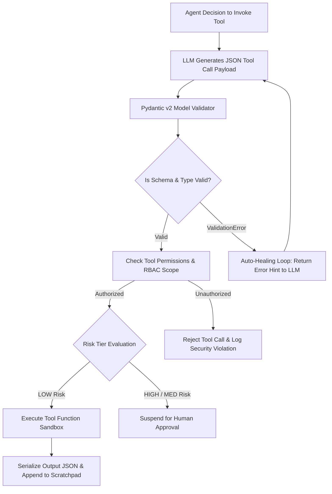

# AI Subsystems — Deterministic Tool Calling & Schema Validation

## Status
**Status:** ✅ IMPLEMENTED (Pydantic v2 JSON Schema Bindings & Self-Healing)

---

## 1. Tool Calling Architecture

OmniAgent AI uses deterministic **JSON Schema Tool Calling** integrated directly with modern LLM function calling APIs (Claude Tool Use, OpenAI Tool Calls). Tools are typed with Pydantic v2 models, equipped with strict parameter boundaries, and wrapped in automated validation handlers.



---

## 2. Tool Definition Pattern

Every enterprise tool is registered using a typed decorator:

```python
from pydantic import BaseModel, Field
from app.tools.registry import register_tool, ToolRiskLevel

class FetchPurchaseOrderInput(BaseModel):
    po_number: str = Field(..., description="The unique purchase order identifier, e.g., PO-9014", pattern=r"^PO-[0-9]{4,8}$")
    include_line_items: bool = Field(default=True, description="Whether to include full line item details")

@register_tool(
    name="fetch_purchase_order",
    description="Retrieve purchase order details, vendor info, and line items from ERP database.",
    risk_level=ToolRiskLevel.LOW,
    required_roles=["operator", "manager", "admin"]
)
async def fetch_purchase_order(params: FetchPurchaseOrderInput, context: ExecutionContext) -> dict:
    return await erp_service.get_po(po_number=params.po_number, tenant_id=context.tenant_id)
```

---

## 3. Schema Auto-Healing Mechanism

If an LLM produces a malformed JSON payload (e.g., passing a string for an integer field or omitting a mandatory property):
1. Pydantic catches the `ValidationError` with exact field error paths (`loc`, `msg`, `type`).
2. The error message is formatted into a system feedback message:
   `"Tool call failed validation: Field 'amount' must be a positive float. Received: 'ten thousand dollars'. Please re-call the tool with corrected parameters."`
3. The LLM corrects the payload on the next step without failing the overall user workflow.
