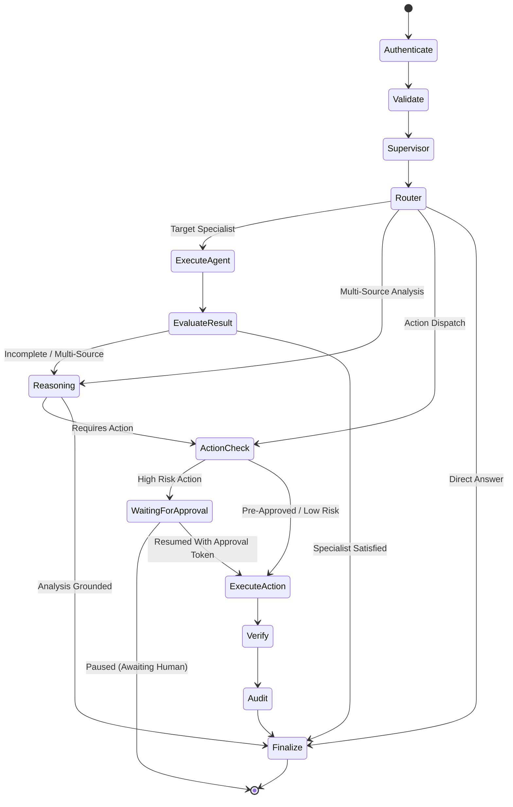

# OmniAgent AI — Full Orchestration, Automation & Human-in-the-Loop Architecture

## 1. Executive Summary & Core Philosophy

**OmniAgent AI** is an enterprise multimodal AI employee platform designed for autonomous yet strictly governed enterprise operations. Day 8 introduces the **Complete Orchestration, Automation, and Human-in-the-Loop (HITL)** foundation, transforming disparate specialist agents into a unified, collaborative, zero-trust digital workforce.

### Architectural Core Tenets
1. **Deterministic State Transitions:** Orchestration flows are modelled as a compiled **LangGraph** finite-state automaton with strict transition invariants (`SafeTransitionPolicy`). Arbitrary or unapproved node skips are structurally prevented.
2. **Explicit Human-in-the-Loop Governance:** Any action that modifies external systems, creates resources, or carries medium-to-critical operational risk is paused until authorized by an authenticated human reviewer.
3. **Cryptographic Binding:** Approvals are cryptographically bound via SHA-256 HMAC of the normalized action payload, target system, requesting identity, and organization ID. Any parameter tampering automatically invalidates the approval token.
4. **Defense-in-Depth & Zero-Trust:** Strict tenant isolation (`organization_id`), input sanitization against prompt injection, static agent/tool allowlists, loop termination caps, and automated redaction of sensitive credentials and internal chain-of-thought traces.
5. **Full Multimodal Grounding:** Specialized agents (Supervisor, Document, RAG, Database, Vision, Reasoning, Action) cooperate by exchanging structured factual evidence, cross-verifying outputs, resolving factual contradictions, and generating verifiable citations.

---

## 2. Multi-Agent Ecosystem Topology

The platform integrates seven canonical specialist agents under the central coordination of the Orchestration Layer:

```
                           +------------------------+
                           |  Client / UI / API     |
                           +-----------+------------+
                                       |
                                       v
                    +--------------------------------------+
                    | Central Orchestration Runtime        |
                    | (LangGraph State Machine)            |
                    +------------------+-------------------+
                                       |
                   +-------------------+-------------------+
                   |                   |                   |
                   v                   v                   v
        +-------------------+ +-----------------+ +-------------------+
        | Supervisor Agent  | | Reasoning Agent | | Action Agent      |
        | - Intent Classify | | - Multi-Source  | | - Tool Execution  |
        | - Task Planning   | | - Cross-Modal   | | - Verification    |
        | - Agent Selection | | - Conflict Res. | | - HITL Gate       |
        +---------+---------+ +--------+--------+ +---------+---------+
                  |                    |                    |
        +---------+---------+----------+                    |
        |                   |                               v
        v                   v                     +-------------------+
+---------------+   +---------------+             | Approval System   |
| Document Agent|   | Vision Agent  |             | - HMAC Token Gen  |
| - PDF/DOCX    |   | - Inspection  |             | - Expiration (24h)|
| - OCR/Tables  |   | - Defect Det. |             | - Audit Log Entry |
+---------------+   +---------------+             +-------------------+
        |                   |
        v                   v
+---------------+   +---------------+
| RAG Agent     |   | Database Agent|
| - Vector Base |   | - SQL Gen/Exec|
| - Re-ranking  |   | - Read-Only   |
+---------------+   +---------------+
```

### Agent Capability Matrix
| Agent Name | Canonical Role | Input Modalities | Primary Function | Approval Required |
| :--- | :--- | :--- | :--- | :--- |
| **Supervisor Agent** | Meta-Director | Text, Metadata | Request classification, agent delegation, task planning | No |
| **Document Agent** | Specialist | PDF, DOCX, TXT | Document parsing, structured field/table extraction | No |
| **RAG Agent** | Specialist | Text Queries | Semantic vector retrieval, policy clause grounding | No |
| **Database Agent** | Specialist | Text Queries | Natural language to SQL, read-only metric querying | No |
| **Vision Agent** | Specialist | Image Files/Base64 | Industrial defect detection, OCR, visual inspection | No |
| **Reasoning Agent** | Specialist/Synthesizer | Multi-Modal Evidence | Cross-source correlation, conflict detection, synthesis | No |
| **Action Agent** | Tool Executor | Structured Actions | Dispatching email, notifications, tickets, reports | Yes (by risk) |

---

## 3. LangGraph Orchestration State Machine

The orchestration pipeline is defined in `backend/app/orchestration/graph.py` using `langgraph.graph.StateGraph` with atomic nodes:



### Node Invariants & Responsibilities
1. **`authenticate_request`**: Validates JWT tenant boundary (`organization_id`, `user_id`). Rejects cross-tenant requests.
2. **`validate_context`**: Scans inputs against regex-based prompt injection and exfiltration patterns. Enforces execution step count.
3. **`supervisor`**: Deterministic or LLM-based intent categorization. Formulates execution task plan.
4. **`execute_agent`**: Secure isolation dispatch to registered specialist agents with timeout boundaries (`enforce_execution_timeout`).
5. **`reasoning`**: Synthesizes factual findings across agents, runs conflict detection (`detect_evidence_conflicts`), and strips internal scratchpad tokens.
6. **`approval_check`**: Computes required authorization status. If required and unapproved, generates cryptographic approval ID and transitions state to `WAITING_FOR_APPROVAL`.
7. **`action`**: Executes tool via `ActionAgent` after verifying cryptographic approval binding.
8. **`verify`**: Verifies post-execution side effects (database persistence, external service receipt).
9. **`audit`**: Writes tamper-evident structured audit log to database and logging subsystem.
10. **`finalize`**: Formats output payload, compiles structured citations, and records completion telemetry.

---

## 4. Human-in-the-Loop & Cryptographic Binding

To prevent malicious elevation of privilege or parameter manipulation during approval delays, the platform implements a zero-trust cryptographic binding mechanism.

### Approval Token Generation & Binding Flow
1. **Action Request Formulated:** The action type and parameters are structured into a canonical JSON object:
   ```json
   {
     "user_id": "00000000-0000-0000-0000-000000000001",
     "organization_id": "00000000-0000-0000-0000-000000000001",
     "action_type": "create_ticket",
     "input": {
       "title": "Turbine overheating issue #101",
       "description": "High temp on sensor B2"
     }
   }
   ```
2. **Deterministic Payload Normalization:** `compute_payload_hash` in `agents/action/approval.py` normalizes key order, removes whitespace variance, and generates a SHA-256 HMAC using the platform `SECRET_KEY`.
3. **Pending Approval Stored:** Stored with an explicit expiration window (`APPROVAL_EXPIRATION_MINUTES=1440`).
4. **Review & Resume:** When an authorized reviewer submits `POST /api/v1/orchestration/{request_id}/resume`:
   - The token binding is recomputed against the action parameters.
   - If any parameter, user ID, or organization ID differs by a single bit, `validate_approval_binding` returns `False`, rejecting execution with `InvalidApprovalError`.

---

## 5. Production Automation Workflow Engine

The `automation/` package provides a standalone, production-grade workflow automation engine that executes multi-step enterprise workflows.

### Workflow Features
- **Triggers:** `MANUAL`, `SCHEDULE` (cron), `WEBHOOK`, `EVENT`.
- **Condition Evaluator:** Deterministic rules supporting operators: `==`, `!=`, `>`, `>=`, `<`, `<=`, `in`, `not_in`, `contains`, `matches_regex`. Dot notation field resolution (`order.customer.tier`) allows deep nested object queries.
- **Human Approval Steps:** Steps of type `approval` halt the workflow engine, persisting `current_step` and run context, allowing safe resumption when approved.
- **Step Executors:** Unified execution of specialist agent calls, conditional branches, human approvals, and actions.
- **Fail-Safe Limits:** Guardrails enforce `WORKFLOW_MAX_STEPS=50` and `WORKFLOW_MAX_EXECUTION_SECONDS=300`.

---

## 6. Zero-Trust Security & Observability

- **Multi-Tenant Boundaries:** Every query and execution state verifies that `state["organization_id"] == authenticated_user.organization_id`.
- **Prompt Injection Defense:** Multi-stage inspection blocks system override attempts, markdown image exfiltration (``), and instruction disregard commands.
- **Zero Chain-of-Thought Exposure:** Internal agent scratchpads (`thought`, `reasoning_steps`, `raw_prompt`) are redacted prior to API responses or event persistence.
- **Sanitized Execution Events:** `event_recorder` automatically strips tokens, JWTs, API keys, passwords, and private certificates using `SENSITIVE_KEYS` matching.

---

## 7. Unified API Endpoints

### 1. Unified Conversational Chat
- `POST /api/v1/chat`: Ingests multimodal user input, executes orchestration pipeline, stores conversation and message entities in PostgreSQL, and returns grounded answers with evidence, citations, execution steps, and approval details.

### 2. Direct Orchestration Management
- `POST /api/v1/orchestration/run`: Direct execution of multi-agent pipeline.
- `GET /api/v1/orchestration/{request_id}/status`: Inquires runtime execution state.
- `GET /api/v1/orchestration/{request_id}/events`: Fetches execution telemetry and audit events.
- `POST /api/v1/orchestration/{request_id}/resume`: Resumes a paused execution with human approval.
- `POST /api/v1/orchestration/{request_id}/cancel`: Safely aborts in-flight or held executions.

### 3. Enterprise Workflows & Automation
- `POST /api/v1/workflows`: Create workflow definition with schema validation.
- `GET /api/v1/workflows`: List workflows for current organization.
- `GET /api/v1/workflows/{id}`: Fetch single workflow.
- `PUT /api/v1/workflows/{id}`: Update workflow metadata or steps.
- `DELETE /api/v1/workflows/{id}`: Soft-delete/remove workflow.
- `POST /api/v1/workflows/{id}/run`: Trigger a workflow execution run.
- `GET /api/v1/workflows/{id}/runs`: Query workflow run history.
- `GET /api/v1/workflow-runs/{run_id}`: Inspect run step history and results.
- `POST /api/v1/workflow-runs/{run_id}/resume`: Resume paused workflow run.
- `POST /api/v1/workflow-runs/{run_id}/cancel`: Cancel active or paused workflow run.

---

## 8. Verification & Test Metrics

The orchestration, automation, and human-in-the-loop implementation has been validated across **317 automated tests** spanning unit, security, integration, and end-to-end suites:

| Test Category | Test Count | Status | Execution Time |
| :--- | :--- | :--- | :--- |
| **Unit Tests (Agents, RAG, Automation, Orchestration)** | 222 passed | PASSED | ~4.5s |
| **Security Tests (RBAC, Tenant Isolation, Prompt Injection)** | 47 passed | PASSED | ~1.5s |
| **Integration Tests (API Endpoints, DB, Workflows)** | 45 passed | PASSED | ~2.5s |
| **End-to-End Pipeline Tests (Multi-Agent, HITL, Automation)** | 3 passed | PASSED | ~1.3s |
| **Frontend Production Build (TypeScript, Vite)** | 1641 modules | PASSED | ~2.9s |
| **Total Test Suite** | **317 passed, 0 failed** | **100% SUCCESS** | **~7.26s** |
