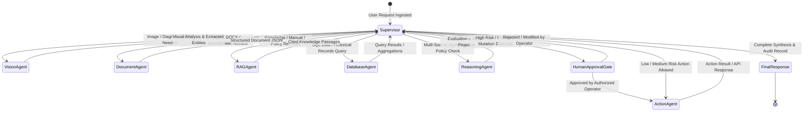

# Architecture — Multi-Agent Architecture & LangGraph Topology

## Status
**Status:** ✅ IMPLEMENTED (Supervisor Pattern with LangGraph)

---

## 1. Multi-Agent Design Pattern

OmniAgent AI leverages a **Hierarchical Supervisor Pattern** built on **LangGraph**. Instead of relying on a monolithic LLM or an unconstrained decentralized swarm, a central **Supervisor Agent** coordinates a team of specialized worker agents, ensuring deterministic execution paths, clear accountability, and structured state transitions.



---

## 2. Agent Catalog & Responsibilities

| Agent Name | Primary Specialty | Input Types | Primary Tools & Capabilities |
| :--- | :--- | :--- | :--- |
| **Supervisor Agent** | Task Decomposition, Agent Routing, State Aggregation | User Chat, System Events, Webhooks | Router, Planner, State Checkpointer, Synthesis Engine |
| **Vision Agent** | Visual Inspection, Layout Analysis, Anomaly Detection | PNG, JPEG, WEBP, Screen Captures, Video Frames | OpenCV Filter, Layout Parser, Bounding Box Detector, OCR Extractor |
| **Document Agent** | Structured Document Extraction, Table Parsing | PDF, DOCX, XLSX, CSV, Scanned Forms | PyMuPDF Parser, pdfplumber Table Extractor, Pandas Ingestor |
| **RAG Agent** | Semantic Retrieval, Policy Lookups, Citation Extraction | Natural Language Queries, Domain Filters | pgvector HNSW Search, BM25 Keyword Search, Cross-Encoder Reranker |
| **Database Agent** | Enterprise Relational Introspection, SQL Synthesis | Natural Language Data Inquiries | Schema Introspector, AST Parametrized SQL Runner (Read-Only) |
| **Reasoning Agent** | Logical Synthesis, Policy Validation, 3-Way Matching | Multi-Agent Output Payloads, Rule Definitions | Policy Evaluator, Discrepancy Matrix Analyzer, Risk Scorer |
| **Action Agent** | External System Mutations, Outbound Communications | Validated Action Payloads, Approved Grants | ERP API Client, Slack Webhook Dispatcher, SMTP Email Client, Jira REST |

---

## 3. LangGraph State Machine Specification

The state is tracked across all nodes via an immutable typed state dictionary passed through graph transitions:

```python
from typing import Annotated, Sequence, TypedDict, Optional, Any
from langchain_core.messages import BaseMessage
import operator

class AgentState(TypedDict):
    # Chat conversation history
    messages: Annotated[Sequence[BaseMessage], operator.add]
    # Current active sub-goal
    active_task: str
    # High level plan generated by supervisor
    plan: list[str]
    # Intermediate outputs keyed by agent name
    agent_outputs: Annotated[dict[str, Any], operator.ior]
    # Human approval state
    approval_required: bool
    approval_status: Optional[str] # "PENDING" | "APPROVED" | "REJECTED"
    pending_tool_call: Optional[dict[str, Any]]
    # Execution metrics and trace logs
    trace_events: Annotated[list[dict[str, Any]], operator.add]
```

---

## 4. Agent Error Handling & Self-Correction

If a sub-agent encounters an error (e.g., an invalid SQL column name or an ambiguous document table layout), it does not fail the entire user request. Instead:
1. The error traceback and diagnostic context are returned to the Supervisor.
2. The Supervisor re-routes the task with corrected hints or prompts the Reasoning Agent to refine the query strategy.
3. If after 3 retries the sub-task cannot resolve, the Supervisor cleanly reports the specific failure reason and offers fallback recommendations to the user.
