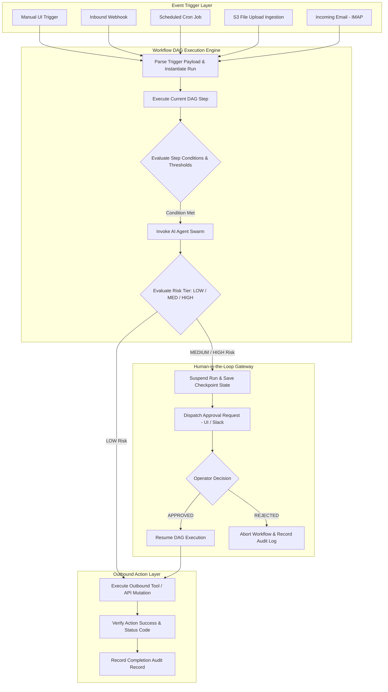

# Architecture — Automation & Workflow Engine Architecture

## Status
**Status:** ✅ IMPLEMENTED (DAG Engine, Triggers, Approvals & Action Dispatcher)

---

## 1. Workflow Engine Architecture

OmniAgent AI features a stateful, event-driven **Workflow Automation Engine** capable of executing complex business processes spanning autonomous AI reasoning, deterministic conditional logic, human approval gates, and external API mutations.



---

## 2. Core Automation Concepts

### 1. Workflow Definition (DAG Schema)
Workflows are defined as declarative JSON/YAML schemas composed of nodes (Triggers, Agent Tasks, Condition Gates, Approvals, and Tool Actions) connected by directional edges:
```json
{
  "workflow_id": "wf_invoice_proc_001",
  "name": "Automated Invoice 3-Way Match & ERP Post",
  "trigger": { "type": "file_upload", "folder": "invoices/" },
  "steps": [
    { "id": "extract_invoice", "type": "agent", "agent": "document_agent" },
    { "id": "fetch_po_gr", "type": "agent", "agent": "database_agent" },
    { "id": "match_items", "type": "agent", "agent": "reasoning_agent" },
    {
      "id": "approval_gate",
      "type": "human_approval",
      "condition": "amount > 5000.00 || match_variance > 0.01",
      "risk_level": "HIGH",
      "approver_roles": ["finance_manager", "admin"]
    },
    { "id": "post_erp", "type": "action", "action": "erp.post_invoice" }
  ]
}
```

### 2. Checkpointing & Fault Tolerance
* Every node execution state is stored in PostgreSQL and Redis.
* If a server restarts while a human approval is pending or an external API is experiencing transient downtime, the workflow resumes seamlessly from its exact suspension point with full execution context intact.
