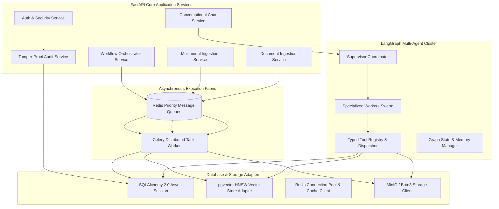

# Architecture — Component Architecture & Subsystems

## Status
**Status:** ✅ IMPLEMENTED (Core Subsystems)

---

## 1. Subsystem Decomposition

OmniAgent AI is architected into discrete, modular components that communicate via well-defined internal interfaces, asynchronous event buses, and typed Pydantic contracts.



---

## 2. Key Subsystem Specifications

### 1. Document & Multimodal Ingestion Subsystem (`app.services.ingestion`)
* **Role:** Ingests heterogeneous binary artifacts, validates MIME signatures, computes SHA-256 content hashes for deduplication, and coordinates async Celery worker tasks for OCR, PDF parsing, Whisper speech transcription, and embedding generation.
* **Interfaces:**
  - `IngestDocumentRequest` -> `DocumentID`, `ChunkCount`, `VectorIDs`
  - `PresignedUploadRequest` -> `S3PresignedURL`, `FileKey`

### 2. Multi-Agent Orchestration Subsystem (`app.agents.engine`)
* **Role:** Manages LangGraph state graphs, dynamic agent routing, context injection, short-term conversational working memory, and tool invocation dispatching.
* **State Contract:**
  ```python
  class AgentGraphState(TypedDict):
      session_id: str
      user_id: int
      messages: list[BaseMessage]
      current_task: str
      plan: list[str]
      agent_scratchpad: dict[str, Any]
      active_agent: str
      requires_approval: bool
      pending_action: Optional[dict[str, Any]]
      risk_level: str
      audit_events: list[dict[str, Any]]
  ```

### 3. Tool Registry & Policy Gateway (`app.tools.registry`)
* **Role:** Centralized repository for all executable tools. Each tool is decorated with Pydantic schema validation, permission requirements, risk classification metadata, and execution timeout constraints.
* **Safety Sandbox:** Rejects undeclared kwargs, validates parameter bounds, and logs execution latency.

### 4. Hybrid Vector Retrieval Subsystem (`app.services.rag`)
* **Role:** Coordinates multi-stage retrieval:
  1. Dense vector cosine search against PostgreSQL `pgvector` HNSW index.
  2. Sparse full-text keyword search using PostgreSQL `tsvector` / BM25.
  3. Reciprocal Rank Fusion (RRF) to merge score distributions.
  4. Cross-Encoder reranking (BAAI/bge-reranker-large) to select top-5 relevant chunks.

### 5. Audit & Compliance Ledger (`app.services.audit`)
* **Role:** Intercepts all critical operations and writes immutable JSON log records with HMAC SHA-256 signatures, user IDs, IP addresses, agent IDs, and execution latency.
