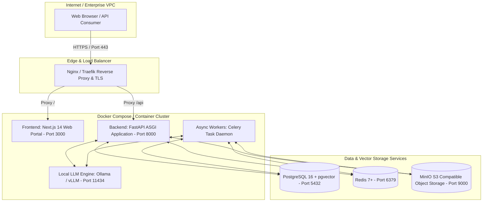

# Architecture — Deployment Architecture & Infrastructure

## Status
**Status:** ✅ IMPLEMENTED (Docker Compose Multi-Container Setup) | 📋 PLANNED (Production Kubernetes Helm Chart)

---

## 1. Deployment Topology

OmniAgent AI is designed for containerized deployment across on-premise servers, hybrid clouds, or public cloud providers (AWS, GCP, Azure). 

---

## 2. Containerized Services Matrix

| Service Name | Base Image | Exposed Ports | Persistent Volumes | Purpose |
| :--- | :--- | :--- | :--- | :--- |
| **`frontend`** | `node:20-alpine` | `3000:3000` | N/A (Stateless) | Next.js 14 App Router portal. |
| **`backend`** | `python:3.11-slim` | `8000:8000` | `/app/logs` | FastAPI async REST API & SSE streaming. |
| **`celery_worker`** | `python:3.11-slim` | N/A | `/tmp/processing` | Background OCR, Whisper, chunking, and workflows. |
| **`postgres`** | `pgvector/pgvector:pg16` | `5432:5432` | `pgdata:/var/lib/postgresql/data` | Relational tables, JSONB state, and vector embeddings. |
| **`redis`** | `redis:7-alpine` | `6379:6379` | `redisdata:/data` | Session cache, rate limiters, and Celery broker. |
| **`minio`** | `minio/minio:RELEASE...` | `9000:9000, 9001:9001` | `miniodata:/data` | Object storage for documents, images, audio, and reports. |
| **`ollama`** | `ollama/ollama:latest` | `11434:11434` | `ollamadata:/root/.ollama` | Optional local LLM inference for air-gapped security. |
