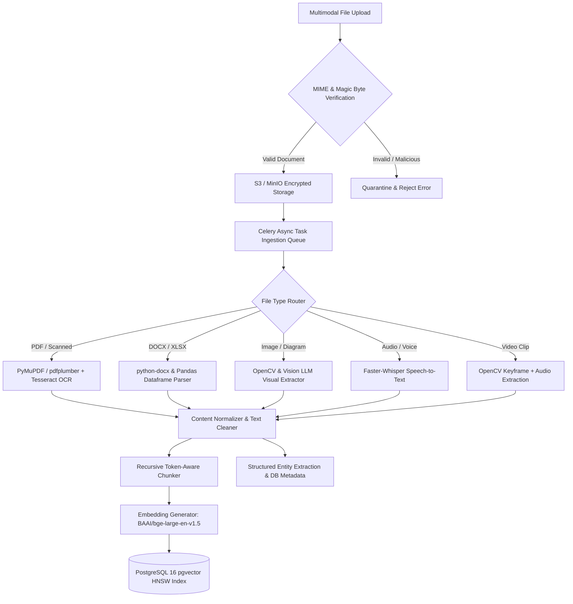

# Architecture — Multimodal Ingestion Pipeline

## Status
**Status:** ✅ IMPLEMENTED (Text, PDF, Office, Image, Audio) | 🚧 PARTIALLY IMPLEMENTED (Video)

---

## 1. Unified Multimodal Ingestion Architecture

OmniAgent AI handles heterogeneous multimodal inputs through a standardized asynchronous ingestion pipeline. Raw files are uploaded directly to Object Storage (S3/MinIO), parsed into structured representations by specialized extraction workers, and indexed for semantic search and agent consumption.

---

## 2. Format-Specific Ingestion Engines

| Media Type | Processing Engine | Output Artifact | Key Capabilities |
| :--- | :--- | :--- | :--- |
| **Digital PDF** | PyMuPDF (fitz) + pdfplumber | Clean Markdown + JSON Tables | Preserves multi-column layout, headers, footnotes, and embedded vector graphics. |
| **Scanned PDF & Images** | Tesseract OCR + Vision LLM | Markdown with OCR confidence metadata | Skew correction, noise reduction, and low-light visual contrast enhancement. |
| **Office DOCX & PPTX** | `python-docx` / `python-pptx` | Structured Markdown text | Extracts nested headings, bullet structures, and speaker notes. |
| **Spreadsheets (XLSX, CSV)** | `pandas` + `openpyxl` | Schema DDL + Dataframe summaries | Tabular column statistics, multi-tab sheet parsing, and formula evaluation. |
| **Audio (WAV, MP3, M4A)** | Faster-Whisper (OpenAI) | VTT Transcript with Speaker Diarization | Multi-lingual speech recognition, background noise filtering, timestamped segments. |
| **Video (MP4, MOV)** | OpenCV + FFmpeg + Whisper | Keyframe image grid + Synced transcript | Scene boundary detection, slide transition capture, visual OCR over video text. |

---

## 3. Chunking & Ingestion Parameters

* **Chunk Size:** 512–1,024 tokens (configurable per workspace policy).
* **Chunk Overlap:** 10% (50–100 tokens) to ensure semantic continuity across sentence boundaries.
* **Metadata Attachment:** Every chunk is tagged with `tenant_id`, `document_id`, `file_name`, `page_number`, `bounding_box_coordinates`, and `created_at` timestamp.
* **Deduplication:** SHA-256 content hashes prevent duplicate vector storage when re-uploading identical documents.
