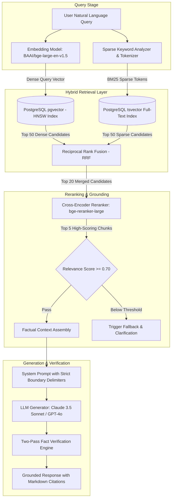

# Architecture — Enterprise Hybrid RAG Architecture

## Status
**Status:** ✅ IMPLEMENTED (Hybrid Dense + Sparse Search with Reranker)

---

## 1. RAG Architecture Overview

OmniAgent AI deploys an enterprise-grade **Hybrid Retrieval-Augmented Generation (RAG)** pipeline designed for zero-hallucination factual grounding, strict multi-tenant isolation, and millisecond vector retrieval.



---

## 2. Multi-Stage Retrieval Breakdown

### Stage 1: Dense Vector Search (`pgvector`)
* **Vector Index:** PostgreSQL `pgvector` extension utilizing **HNSW (Hierarchical Navigable Small World)** indexing (`m = 16`, `ef_construction = 64`).
* **Distance Metric:** Cosine Distance (`vector_cosine_ops`).
* **Embedding Model:** `BAAI/bge-large-en-v1.5` (1,024 dimensions) or OpenAI `text-embedding-3-large` (1,536 dimensions).
* **Throughput:** Sub-50ms retrieval over millions of enterprise document chunks.

### Stage 2: Sparse Full-Text Search (BM25 / `tsvector`)
* Captures exact keyword matches, part numbers, PO codes, acronyms, and product IDs that dense embeddings occasionally blur.
* Uses PostgreSQL native `tsvector` with English and custom domain stopword dictionaries.

### Stage 3: Reciprocal Rank Fusion (RRF)
Merges dense and sparse ranks using the standard reciprocal rank formula:
$$RRF\_Score(d) = \sum_{m \in M} \frac{1}{k + r_m(d)}$$
where $k = 60$, ensuring balanced scoring across dense and keyword recall.

### Stage 4: Cross-Encoder Reranking
* Evaluates query-document pairs simultaneously using `BAAI/bge-reranker-large`.
* Re-orders candidates by semantic relevance score $[0.0, 1.0]$. Only chunks scoring $\ge 0.70$ are injected into the LLM context.

---

## 3. Strict Multi-Tenant Isolation & Document Security

Every vector query enforces mandatory database-level tenant and permission filtering:
```sql
SELECT chunk_id, content, metadata, 1 - (embedding <=> :query_embedding) AS similarity
FROM document_chunks
WHERE tenant_id = :current_tenant_id
  AND document_id IN (SELECT id FROM documents WHERE access_role <= :user_role)
ORDER BY embedding <=> :query_embedding
LIMIT 50;
```
No tenant can ever retrieve or leak vector embeddings belonging to another organization.
