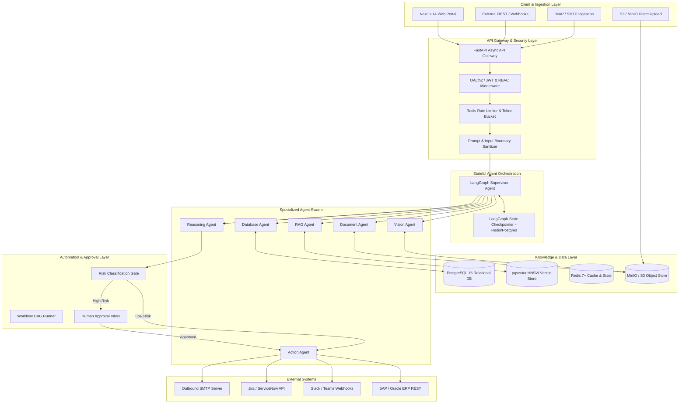

# Architecture — System Architecture & Topology

## Status
**Status:** ✅ IMPLEMENTED (Production Architecture)

---

## 1. High-Level Architectural Topology

OmniAgent AI is engineered with a decoupled, asynchronous, layered architecture designed for enterprise scalability, fault tolerance, and zero-trust security. The platform seamlessly bridges real-time multimodal user interactions with complex stateful multi-agent execution graphs and background worker pipelines.

---

## 2. Core Architectural Layers

### Layer 1: Client & Ingestion Layer
* **Next.js 14 Single Page Application:** Delivers a responsive, real-time dashboard built on React 18, Tailwind CSS, and Shadcn UI. Communicates via REST for transactional state, Server-Sent Events (SSE) for streaming agent thought logs and text tokens, and WebSockets for real-time human approval notifications.
* **Direct Multipart S3 Ingestion:** Large multimodal files (high-resolution images, 500-page PDFs, audio recordings, video files) are streamed directly to S3/MinIO using presigned S3 URLs, reducing backend memory overhead.

### Layer 2: API Gateway & Security Layer
* **FastAPI Async Engine:** Powered by Uvicorn ASGI, managing non-blocking I/O operations and asynchronous coroutines across concurrent user sessions.
* **Authentication & RBAC Middleware:** Inspects incoming `Authorization: Bearer <JWT>` tokens, validates cryptographically with asymmetric HMAC SHA-256 keys, and enforces route-level role permissions (SuperAdmin, Admin, Manager, Operator, Viewer, Auditor).
* **Zero-Trust Boundary Sanitizer:** Detects prompt injection payloads and wraps all raw document content within strict delimiter tokens (`<<<UNTRUSTED_CONTENT>>>`).

### Layer 3: LangGraph Agent Orchestration Layer
* **Supervisor Controller:** Implements a Directed Acyclic Graph (DAG) state machine via LangGraph. Maintains conversational session state in Redis checkpointers and dynamically routes tasks to specialized worker sub-agents.
* **State Checkpointing:** Every intermediate step, tool invocation, and sub-agent output is persisted atomically to prevent state loss during system restarts or network interrupts.

### Layer 4: Specialized Worker Agent Swarm
* **Vision Agent:** Specialized in visual feature extraction, layout geometry analysis, OCR extraction, and anomaly bounding box detection.
* **Document Agent:** Specializes in structural parsing of complex PDFs, DOCX files, spreadsheets, and tabular data extraction.
* **RAG Agent:** Executes hybrid vector (pgvector) and keyword retrieval over enterprise manuals, policies, and internal documentation.
* **Database Agent:** Generates and executes read-only, AST-validated SQL queries against relational data warehouses.
* **Reasoning Agent:** Performs multi-step logical deduction, policy compliance verification, cross-document reconciliation, and risk classification.
* **Action Agent:** Executes validated tool mutations against external enterprise systems (ERP, CRM, Slack, Email).

### Layer 5: Enterprise Knowledge & Vector Storage Layer
* **PostgreSQL 16 + pgvector:** Unifies relational application metadata (users, sessions, workflows, audit logs) and high-dimensional vector embeddings (1024/1536-dim) in a single ACID-compliant database engine.
* **Redis 7+:** High-speed in-memory store for session locks, token bucket rate limiters, LangGraph working memory checkpointers, and Celery message brokers.
* **MinIO / AWS S3:** Scalable, encrypted object storage for immutable raw document archives, visual keyframes, audio clips, and generated PDF reports.

### Layer 6: Automation & Human-in-the-Loop (HITL) Layer
* **Deterministic Risk Engine:** Computes risk scores based on operation type, financial threshold, data sensitivity, and tenant policy.
* **Approval Inbox & Workflow Dispatcher:** Suspends workflow DAGs when high-risk operations are detected, awaiting authorized operator review and cryptographic approval signatures before proceeding.
