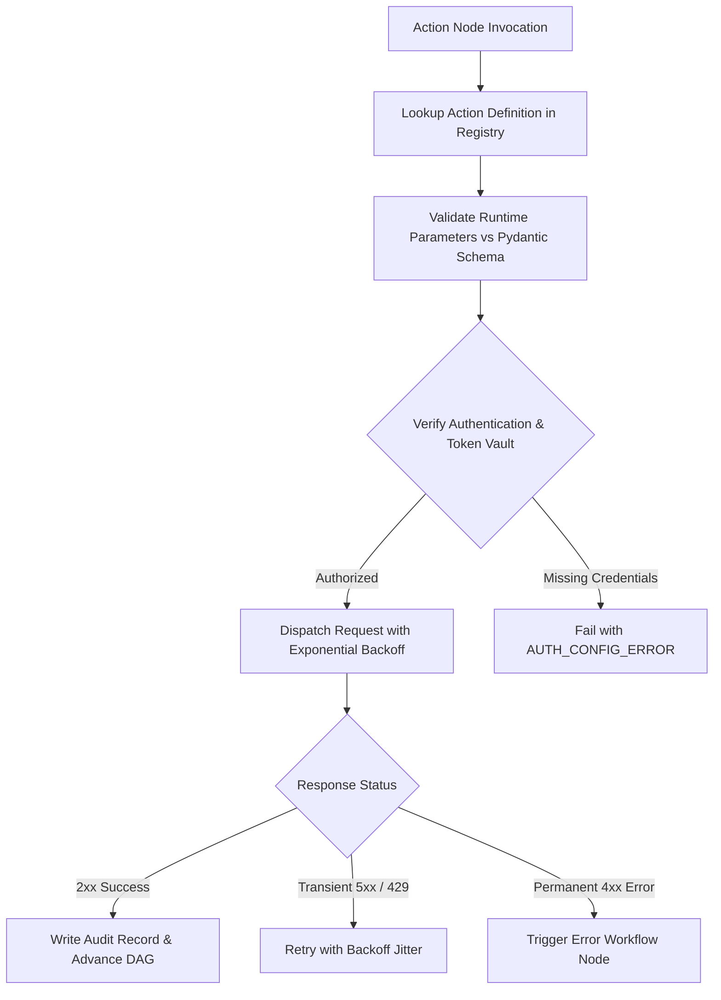

# Automation — Outbound Actions & Integrations Registry

## Status
**Status:** ✅ IMPLEMENTED (Core Connectors: Email, Slack, DB Mutations, Jira) | 🚧 PARTIALLY IMPLEMENTED (Direct SAP ERP Connector)

---

## 1. Action Registry Overview

All outbound side-effects and external mutations in OmniAgent AI are registered in the centralized **Action Registry**. Each action is defined with explicit Pydantic parameter schemas, execution timeouts, rate limits, and risk classification metadata.

---

## 2. Standard Enterprise Action Catalog

| Action Name | Target System | Risk Tier | Description |
| :--- | :--- | :--- | :--- |
| **`email.send_smtp`** | SMTP / SendGrid | MEDIUM | Sends transactional emails with PDF attachments and Markdown bodies. |
| **`slack.post_card`** | Slack Webhook / Bot API | LOW | Posts interactive Block Kit status cards with action buttons to Slack channels. |
| **`jira.create_issue`** | Atlassian Jira REST | LOW | Creates bug/task issues with priority tags, stack traces, and component labels. |
| **`erp.post_invoice`** | SAP / Oracle REST API | HIGH | Posts finalized accounts payable invoices directly into the general ledger. |
| **`db.execute_mutation`**| PostgreSQL / MySQL | HIGH | Executes authorized, parametrized DML operations against internal databases. |
| **`document.generate_pdf`**| Internal Weasyprint | LOW | Compiles Markdown and dynamic data into styled enterprise PDF executive reports. |
