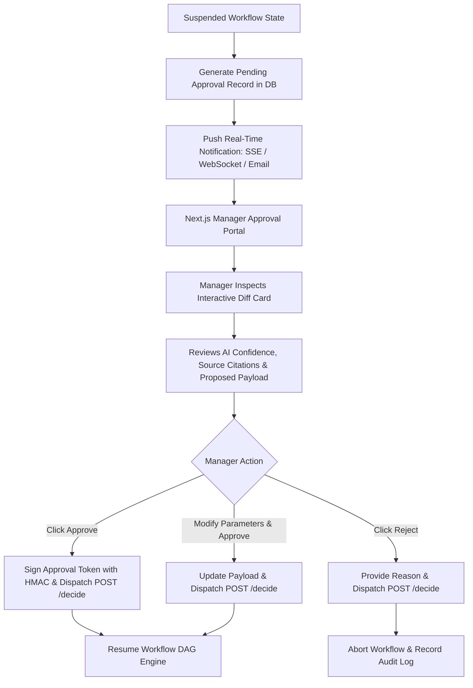

# Automation — Human Approval Inbox & Authorization System

## Status
**Status:** ✅ IMPLEMENTED (Next.js Approval UI & REST API Endpoints)

---

## 1. Approval System Architecture

The **Approval System** provides a unified operational dashboard where enterprise managers review, inspect diffs, verify AI agent reasoning chains, and authorize or reject pending actions.



---

## 2. Interactive Approval Card Schema

```json
{
  "approval_id": "appr_771829",
  "workflow_id": "wf_invoice_proc_001",
  "task_name": "Post AP Invoice Payment to SAP",
  "risk_level": "HIGH",
  "created_at": "2026-08-15T14:32:00Z",
  "required_role": "finance_manager",
  "summary": "3-Way Match verified for Vendor 'Apex Precision' against PO-9014. Total: $14,250.00 USD.",
  "ai_reasoning_trace": [
    "Document Agent extracted $14,250.00 from invoice_8812.pdf (Confidence: 99.2%)",
    "Database Agent verified PO-9014 for $14,250.00 in PostgreSQL",
    "Reasoning Agent confirmed 0.00% variance across line items"
  ],
  "proposed_action": {
    "tool": "erp.post_invoice",
    "parameters": {
      "invoice_id": "INV-2026-8812",
      "vendor_id": "VEND-APEX-01",
      "amount": 14250.00,
      "currency": "USD"
    }
  }
}
```

---

## 3. Security & Non-Repudiation

* Approvals require active JWT session credentials matching the `required_role`.
* Every decision captures the `approver_user_id`, `decision_timestamp`, `ip_address`, and `digital_hmac_signature`.
* Prevents privilege escalation and provides tamper-proof non-repudiation for financial compliance audits.
