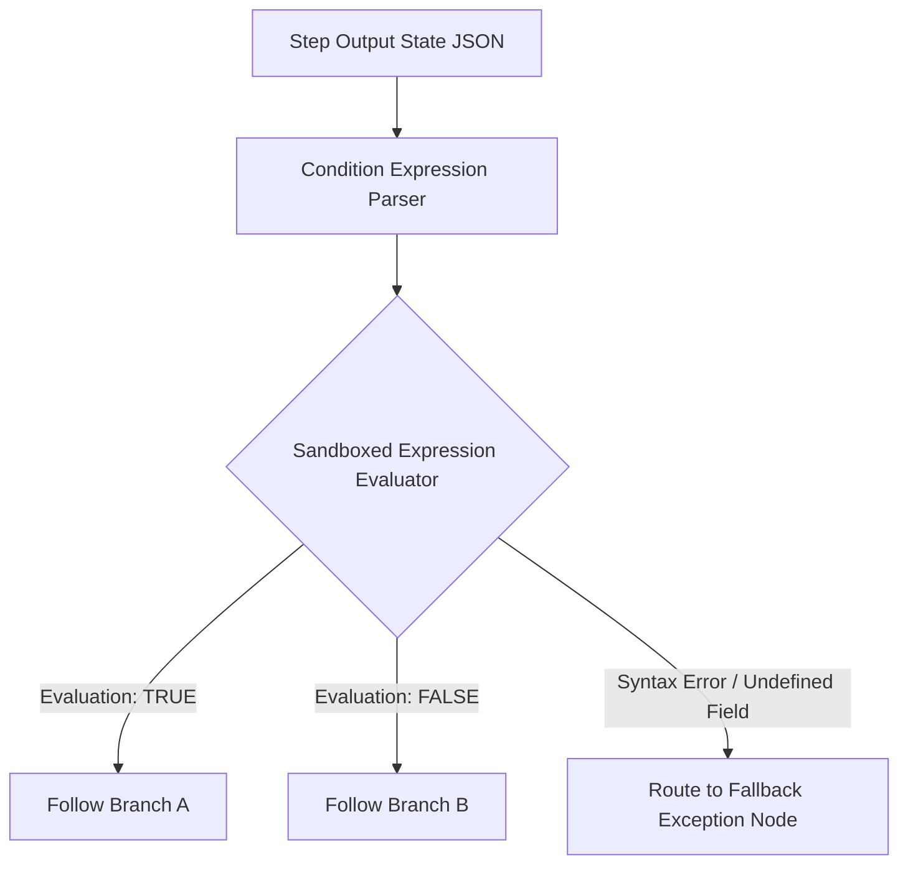

# Automation — Deterministic Condition Evaluator

## Status
**Status:** ✅ IMPLEMENTED (AST Rule Engine with Boolean Expressions)

---

## 1. Overview & Evaluation Engine

The **Condition Evaluator** provides safe, sandboxed evaluation of branching logic within workflow DAGs. It prevents uncontrolled LLM hallucinations from making arbitrary routing decisions by evaluating explicit mathematical, string, and categorical rules over structured step outputs.



---

## 2. Condition Syntax & Operators

Supported operators in the safe evaluation engine:
* **Comparison:** `==`, `!=`, `<`, `<=`, `>`, `>=`
* **Logical:** `&&` (AND), `||` (OR), `!` (NOT)
* **Containment:** `in`, `not in`, `contains`, `startswith`, `endswith`
* **Null Check:** `is_null`, `is_not_null`

### Examples
```javascript
// Rule 1: High value invoice exceeding variance tolerance
payload.total_amount > 5000.00 || payload.variance_percentage > 0.01

// Rule 2: Critical machine defect with high model confidence
payload.defect_type == "surface_pitting" && payload.confidence >= 0.90

// Rule 3: Support ticket priority classification
payload.sentiment == "URGENT" && payload.customer_tier in ["ENTERPRISE_VIP", "STRATEGIC"]
```
