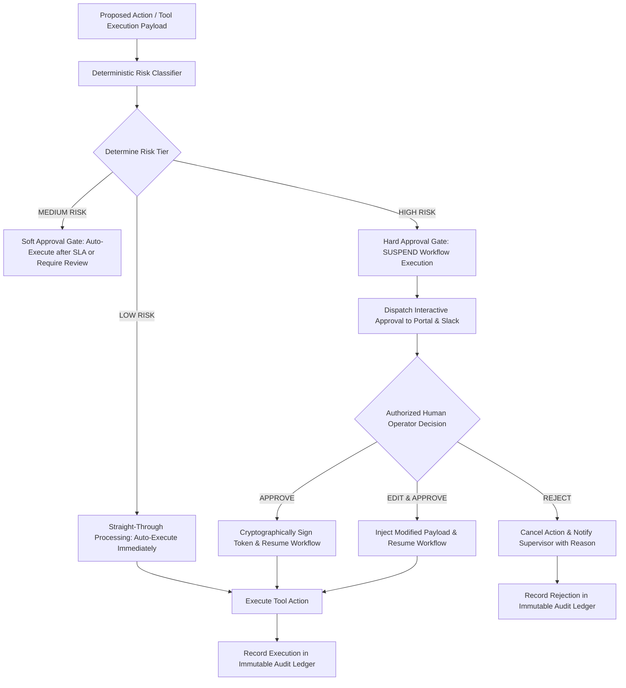

# Automation — Human-in-the-Loop (HITL) Architecture & Risk Tiers

## Status
**Status:** ✅ IMPLEMENTED (Tiered Risk Classification & Asynchronous Suspension)

---

## 1. Why Enterprise AI Requires Deterministic Human Approval

Fully autonomous AI agents without deterministic boundaries pose severe risks to enterprise stability:
* **Financial Risk:** Accidental disbursement of unauthorized vendor payments.
* **Operational Risk:** Prematurely shutting down manufacturing equipment based on misdiagnosed sensor data.
* **Reputational Risk:** Sending unvetted automated legal notices or external customer emails.
* **Data Integrity Risk:** Executing bulk deletions or schema drops on production databases.

OmniAgent AI resolves this by enforcing a **Risk-Stratified Human-in-the-Loop Gateway**. Actions are categorized into three distinct operational risk tiers.

---

## 2. Risk Tier Classification Matrix

| Risk Tier | Policy Rule & Criteria | Examples | Execution Behavior |
| :--- | :--- | :--- | :--- |
| **LOW RISK** | Read-only operations, internal logging, low-impact notifications. | • Generating summary reports • Reading database rows • Creating Tier 3 Jira tickets • Posting internal Slack updates | **Auto-Executed Immediately** without human interruption. |
| **MEDIUM RISK** | Reversible external communications, minor operational changes. | • Sending external customer emails • Rescheduling calendar meetings • Updating non-financial CRM contact status | **Optional Review / Auto-Pass** with audit notification. |
| **HIGH RISK** | Financial disbursements, data mutations, critical machinery commands. | • Financial approvals > $1,000 • Posting journal entries to ERP • Deleting database records • Industrial machine emergency stops | **Strictly Suspended** until cryptographically signed by authorized role. |

---

## 3. Asynchronous Workflow Suspension Mechanism

1. When a HIGH RISK node is reached, the LangGraph checkpointer serializes the complete workflow execution state into PostgreSQL and Redis.
2. The HTTP API connection returns a `202 Accepted` status with `{ "status": "PENDING_APPROVAL", "approval_id": "appr_99120" }`.
3. The server frees all worker threads. No background process sits idle in a busy-wait loop.
4. When the human manager clicks **"Approve"** in the Next.js portal, an authenticated webhook triggers `/api/v1/approvals/{id}/decide`, deserializing state and resuming the DAG exactly where it paused.
