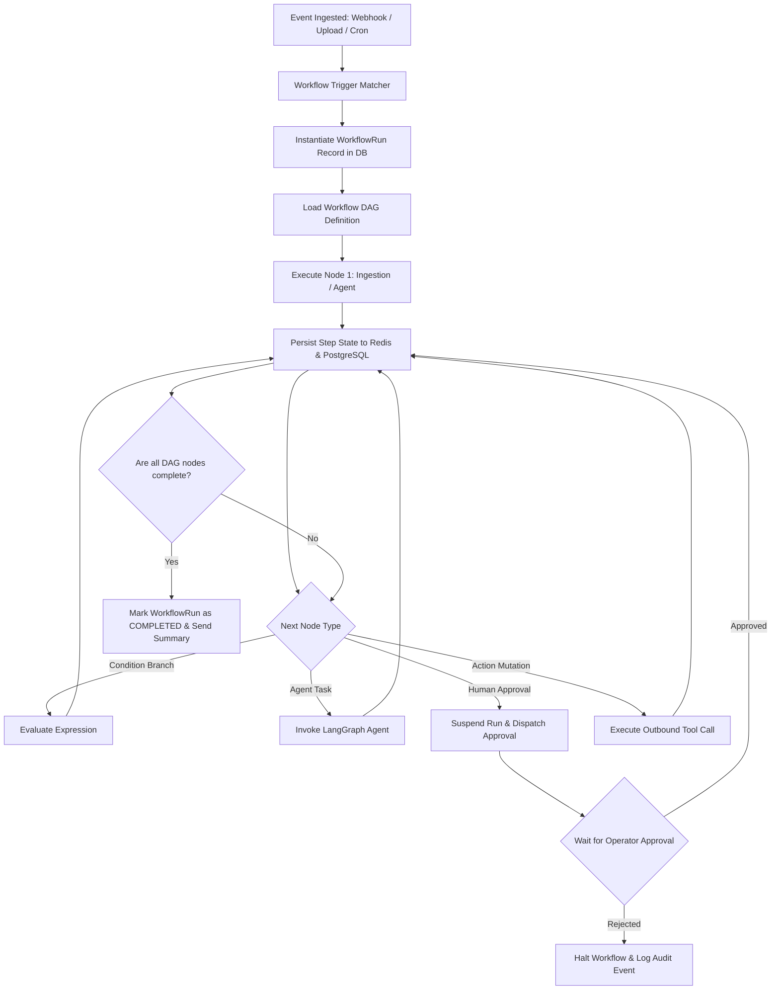

# Automation — Workflow Engine Architecture & Execution

## Status
**Status:** ✅ IMPLEMENTED (DAG Workflow Engine with Redis/PostgreSQL State)

---

## 1. Workflow Engine Overview

The OmniAgent AI **Workflow Engine** is a distributed, stateful orchestrator that executes enterprise business processes modeled as Directed Acyclic Graphs (DAGs). It coordinates asynchronous agent reasoning steps, deterministic condition checks, human approval gates, and outbound tool actions.

---

## 2. Technical Capabilities

| Capability | Specification | Implementation Detail |
| :--- | :--- | :--- |
| **State Persistence** | PostgreSQL + Redis Checkpoints | Every DAG node transition writes execution logs and scratchpads atomically. |
| **Concurrency** | Celery Distributed Workers | Concurrent multi-tenant workflow execution across distributed task queues. |
| **Idempotency** | UUID Idempotency Keys | Guarantees that retrying a failed workflow step does not double-post ERP invoices or resend duplicate emails. |
| **Suspension & Resume** | LangGraph Memory Checkpointer | Workflows can stay paused for days waiting for human approval without consuming active server threads. |
| **Timeout & SLA** | Configurable Step Timeouts | Steps exceeding execution limits (e.g., 30s for LLM inference) trigger retry or fallback branches. |
