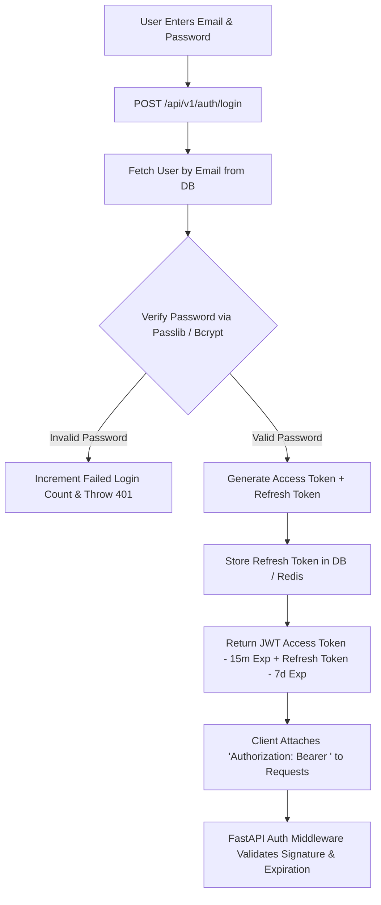

# Backend — Authentication & Session Management

## Status
**Status:** ✅ IMPLEMENTED (OAuth2 Password Flow + JWT Bearer Tokens)

---

## 1. Authentication Architecture

Authentication in OmniAgent AI utilizes industry-standard **OAuth2 with Password Bearer flow** and cryptographic JSON Web Tokens (JWT).

---

## 2. Token Security Specifications

* **Access Token:** Short-lived (15 minutes), signed using HMAC SHA-256 (`HS256`) containing `user_id`, `email`, `role`, `tenant_id`, and `exp`.
* **Refresh Token:** Long-lived (7 days), stored in encrypted database table; rotated upon every refresh invocation.
* **Password Hashing:** Passlib with `bcrypt` (12 work factor rounds).
* **Brute-Force Protection:** IP & email rate-limited to 5 failed attempts per 15-minute window via Redis token bucket.
