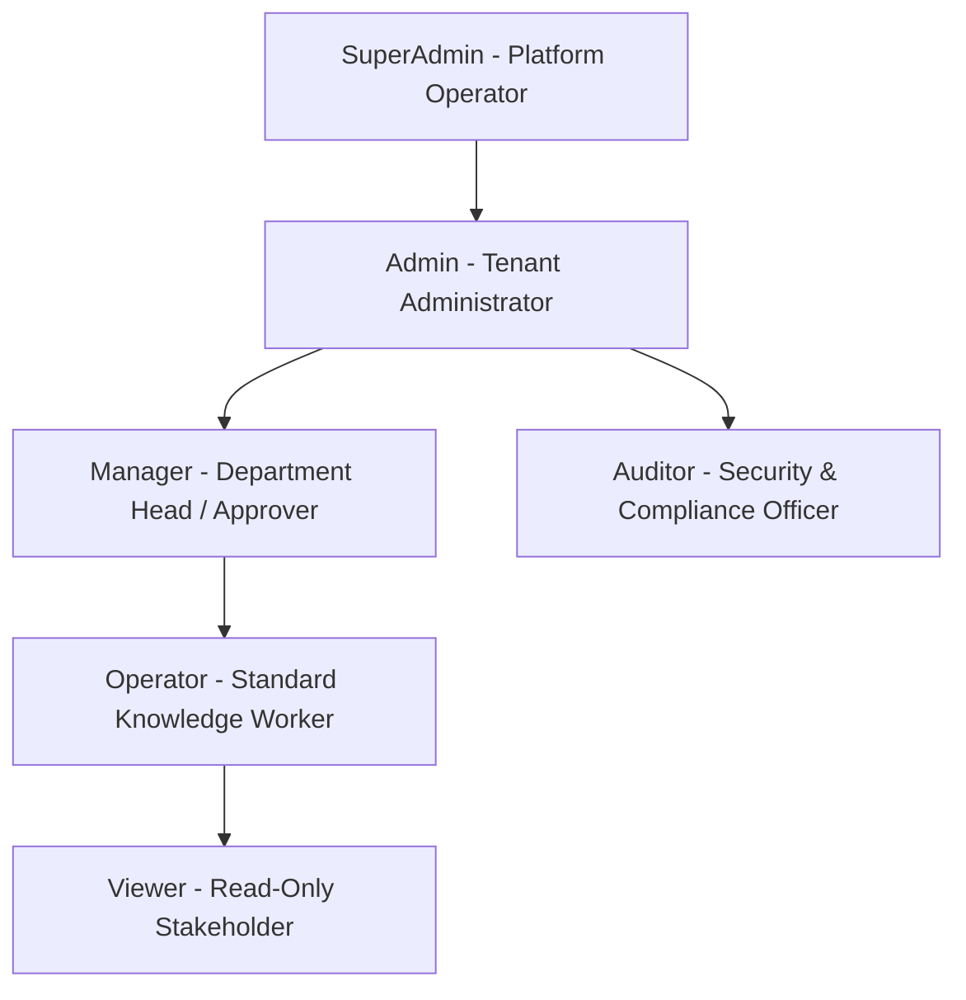

# Backend — Authorization & Role-Based Access Control (RBAC)

## Status
**Status:** ✅ IMPLEMENTED (Granular 6-Tier Role Matrix)

---

## 1. Enterprise RBAC Hierarchy

OmniAgent AI implements a multi-tenant Role-Based Access Control system that strictly isolates data and operations across organizational boundaries.



---

## 2. Permissions Matrix

| Feature / Resource Scope | SuperAdmin | Admin | Manager | Operator | Viewer | Auditor |
| :--- | :---: | :---: | :---: | :---: | :---: | :---: |
| **Manage Tenant & Billing** | ✅ | ✅ | ❌ | ❌ | ❌ | ❌ |
| **User & Role Management** | ✅ | ✅ | ❌ | ❌ | ❌ | ❌ |
| **Upload & Ingest Documents**| ✅ | ✅ | ✅ | ✅ | ❌ | ❌ |
| **Execute AI Agent Workflows**| ✅ | ✅ | ✅ | ✅ | ❌ | ❌ |
| **Approve High-Risk Actions**| ✅ | ✅ | ✅ | ❌ | ❌ | ❌ |
| **View Audit Trails & Logs** | ✅ | ✅ | ✅ | ❌ | ❌ | ✅ |
| **View Dashboards & Reports** | ✅ | ✅ | ✅ | ✅ | ✅ | ✅ |
| **Manage Integrations/Keys** | ✅ | ✅ | ❌ | ❌ | ❌ | ❌ |

---

## 3. Dependency Injection in FastAPI

```python
from fastapi import Depends, HTTPException, status
from app.core.security import get_current_user
from app.models.user import User, UserRole

def require_role(allowed_roles: list[UserRole]):
    async def role_checker(current_user: User = Depends(get_current_user)) -> User:
        if current_user.role not in allowed_roles:
            raise HTTPException(
                status_code=status.HTTP_403_FORBIDDEN,
                detail=f"Operation requires one of roles: {[r.value for r in allowed_roles]}"
            )
        return current_user
    return role_checker
```
