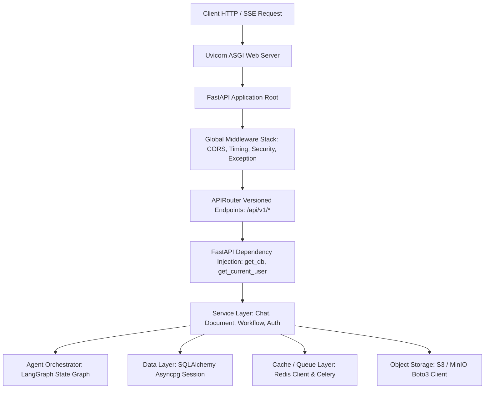

# Backend — Backend Service Architecture & Lifespan

## Status
**Status:** ✅ IMPLEMENTED (FastAPI Async Architecture)

---

## 1. Backend Core Overview

The backend of OmniAgent AI is built on **FastAPI (Python 3.11+)** using asynchronous non-blocking I/O (`asyncio`), dependency injection, typed Pydantic v2 data models, and SQLAlchemy 2.0 async ORM sessions.



---

## 2. Directory Layout (`backend/app/`)

```text
backend/app/
├── main.py                   # FastAPI Application Entrypoint & Lifespan Handlers
├── config.py                 # Pydantic BaseSettings Environment Configuration
├── core/
│   ├── security.py           # JWT Creation, Password Hashing & HMAC Signing
│   ├── database.py           # Async SQLAlchemy Engine & SessionMaker
│   ├── redis.py              # Redis Connection Pool Manager
│   └── exceptions.py         # Custom RFC 7807 Exception Classes
├── models/                   # SQLAlchemy 2.0 ORM Declarative Models
├── schemas/                  # Pydantic v2 Request & Response Data Contracts
├── api/v1/                   # RESTful Route Controllers (auth, chat, docs, etc.)
├── services/                 # Enterprise Business Logic Subsystems
├── agents/                   # LangGraph Multi-Agent Nodes & State Definitions
├── multimodal/               # Ingestion Parsers (PDF, OCR, Whisper, Vision)
├── tools/                    # Registered Deterministic Tool Definitions
└── workers/                  # Celery Task Handlers & Beat Schedulers
```

---

## 3. Application Lifespan & Connection Management

The FastAPI application manages database connection pools, Redis clients, and ML models during startup and shutdown events using the `@asynccontextmanager` lifespan protocol:

```python
@asynccontextmanager
async def lifespan(app: FastAPI):
    # Startup: Initialize DB pools, Redis client, load embedding models
    await init_db()
    await init_redis()
    logger.info("OmniAgent AI Backend initialized successfully.")
    yield
    # Shutdown: Close connections cleanly
    await close_db()
    await close_redis()
    logger.info("OmniAgent AI Backend shut down cleanly.")
```
