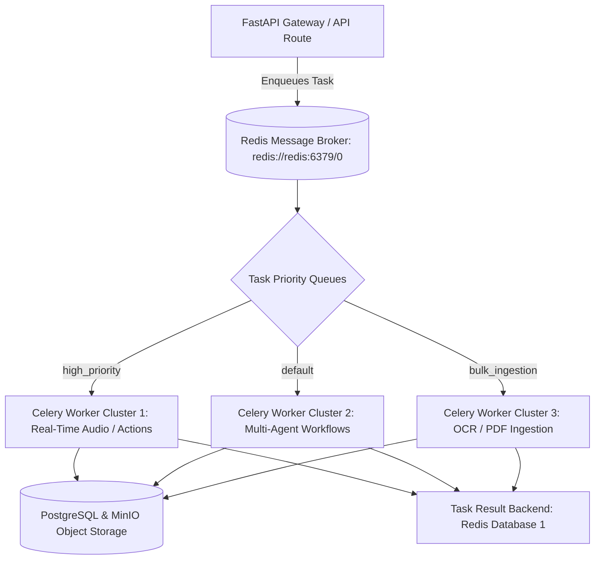

# Backend — Background Jobs & Asynchronous Worker Architecture

## Status
**Status:** ✅ IMPLEMENTED (Celery with Redis Message Broker)

---

## 1. Asynchronous Task Architecture

Heavy computational tasks—such as batch OCR, 500-page PDF ingestion, audio Whisper transcription, vector indexing, and recurring workflow schedules—are offloaded to distributed **Celery Workers** backed by **Redis 7+**.

---

## 2. Worker Task Catalog

| Task Name | Queue | Retry Policy | Timeout | Purpose |
| :--- | :--- | :--- | :--- | :--- |
| **`tasks.ingest_document`** | `bulk_ingestion` | 3 retries with exponential backoff | 600s | OCR, PDF extraction, chunking, and embedding generation. |
| **`tasks.transcribe_audio`**| `high_priority` | 2 retries | 180s | Whisper ASR transcription of voice clips. |
| **`tasks.execute_workflow`**| `default` | 3 retries (idempotent) | 300s | Background execution of multi-step DAG workflows. |
| **`tasks.scheduled_health`**| `default` | None | 30s | Periodic Celery Beat heartbeat and vector health verification. |
