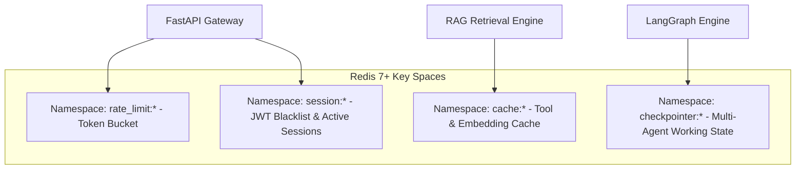

# Backend — In-Memory Caching & Rate Limiting (Redis 7+)

## Status
**Status:** ✅ IMPLEMENTED (Redis Caching, Rate Limiting & Checkpointing)

---

## 1. Caching & Session Storage Architecture

OmniAgent AI utilizes **Redis 7+** for ultra-low latency (< 1ms) operations across four distinct namespaces:

---

## 2. Key Caching Policies

| Namespace / Key Pattern | TTL / Expiration | Invalidation Trigger | Purpose |
| :--- | :--- | :--- | :--- |
| **`cache:embedding:{sha256}`** | 7 Days | LRU Eviction | Prevents re-computing embeddings for repeated search queries. |
| **`cache:tool:{hash}`** | 1 Hour | On Entity Mutation | Caches read-only ERP / DB queries (e.g., vendor list lookups). |
| **`rate_limit:{ip}:{user_id}`** | 60 Seconds | Automatic TTL expiry | Enforces 120 req/min API rate limits via Redis token bucket. |
| **`session:blacklist:{jwt_jti}`**| Until JWT Expiry | Automatic TTL expiry | Immediate invalidation of revoked JWT tokens upon logout. |
