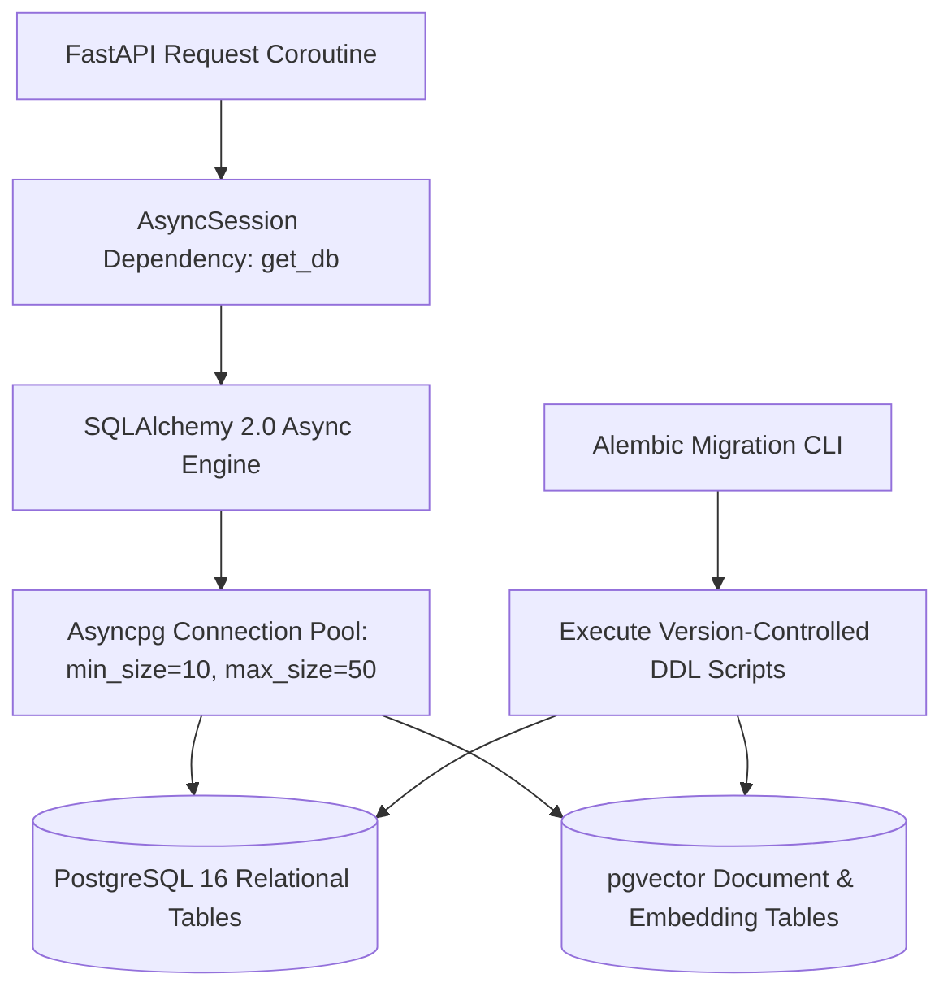

# Backend — Database Layer (SQLAlchemy 2.0 & PostgreSQL 16)

## Status
**Status:** ✅ IMPLEMENTED (Asyncpg, SQLAlchemy 2.0 & Alembic)

---

## 1. Database Architecture Overview

OmniAgent AI utilizes **PostgreSQL 16** with the **`pgvector`** extension as a unified database engine for transactional relational entities (users, workflows, approvals, audit logs) and high-dimensional vector embeddings.



---

## 2. Asynchronous Session Management

```python
from sqlalchemy.ext.asyncio import create_async_engine, async_sessionmaker, AsyncSession
from app.config import settings

engine = create_async_engine(
    settings.DATABASE_URL,
    echo=False,
    pool_size=20,
    max_overflow=10,
    pool_pre_ping=True
)

AsyncSessionLocal = async_sessionmaker(
    bind=engine,
    class_=AsyncSession,
    expire_on_commit=False,
    autocommit=False,
    autoflush=False
)

async def get_db() -> AsyncSession:
    async with AsyncSessionLocal() as session:
        try:
            yield session
            await session.commit()
        except Exception:
            await session.rollback()
            raise
        finally:
            await session.close()
```
