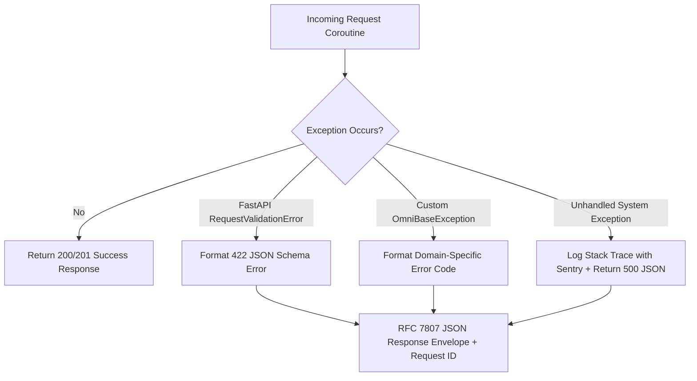

# Backend — Error Handling & Exception Management (RFC 7807)

## Status
**Status:** ✅ IMPLEMENTED (Global Exception Handlers & RFC 7807 Compliance)

---

## 1. Global Exception Architecture

OmniAgent AI catches all operational, validation, and third-party API exceptions through standardized FastAPI exception middleware, mapping internal errors to **RFC 7807 Problem Details for HTTP APIs**.

---

## 2. Standard Error Codes Matrix

| HTTP Status | Error Code | Description | Client Action |
| :--- | :--- | :--- | :--- |
| **400 Bad Request** | `INVALID_PAYLOAD` | Request payload failed business logic validation. | Fix parameters and retry. |
| **401 Unauthorized**| `AUTHENTICATION_REQUIRED` | Missing or expired JWT access token. | Re-authenticate via `/api/v1/auth/refresh`. |
| **403 Forbidden** | `PERMISSION_DENIED` | Authenticated user lacks required RBAC role. | Contact tenant administrator. |
| **404 Not Found** | `RESOURCE_NOT_FOUND` | Specified document, workflow, or approval does not exist. | Verify UUID key. |
| **422 Unprocessable**| `SCHEMA_VALIDATION_ERROR`| Pydantic validation failure on field types or constraints. | Inspect `details` object. |
| **429 Too Many Req**| `RATE_LIMIT_EXCEEDED` | Exceeded 120 requests/minute API ceiling. | Backoff according to `Retry-After` header. |
| **500 Internal Error**| `INTERNAL_SERVER_ERROR`| Unhandled server or database exception. | Quote `request_id` to support. |
