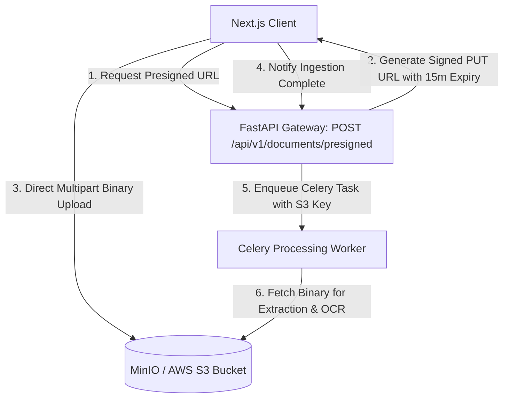

# Backend — Object File Storage Architecture (S3 / MinIO)

## Status
**Status:** ✅ IMPLEMENTED (S3 Presigned URLs & MinIO Local Compatibility)

---

## 1. Object Storage Architecture

OmniAgent AI relies on **S3-Compatible Object Storage** (AWS S3 or self-hosted MinIO) for storing raw uploaded documents, extracted images, speech audio files, and generated executive PDF reports.



---

## 2. Bucket Organization & Multi-Tenant Fencing

All object keys follow strict tenant namespace partitioning:
```text
s3://omni-enterprise-artifacts/
└── {tenant_id}/
    ├── documents/
    │   └── {document_id}/{filename}.pdf
    ├── images/
    │   └── {image_id}/{filename}.png
    ├── audio/
    │   └── {audio_id}/{filename}.wav
    └── generated_reports/
        └── {report_id}/executive_summary.pdf
```

* **Security:** Presigned URLs expire after 15 minutes and restrict uploads to declared Content-Type and maximum size (e.g., 50MB).
