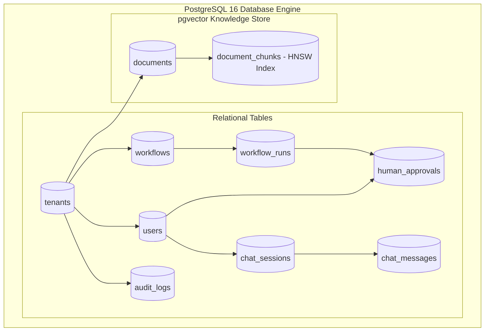

# Database — Relational & Vector Storage Overview (PostgreSQL 16 + pgvector)

## Status
**Status:** ✅ IMPLEMENTED (Production Schema with pgvector)

---

## 1. Storage Architecture Overview

OmniAgent AI leverages a single, unified, ACID-compliant database engine—**PostgreSQL 16** with the **`pgvector`** extension—to manage both relational transactional metadata and high-dimensional semantic vector embeddings.

---

## 2. Core Database Characteristics

* **Unified Consistency:** Foreign key relationships maintain referential integrity across documents, chunks, workflows, and audit logs.
* **ACID Transactions:** Financial approval workflows and state transitions execute within atomic database transactions with rollback capability.
* **Vector Extensions:** Uses `pgvector` for 1024-dimensional cosine distance similarity searches with HNSW indexes.
