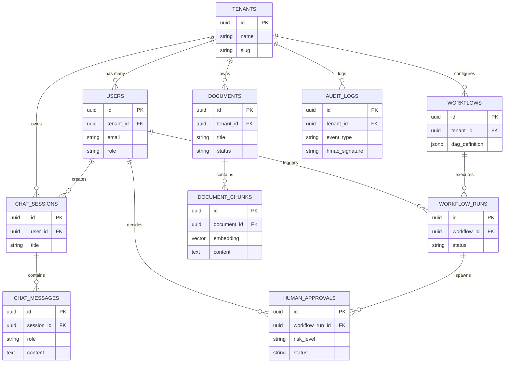

# Database — Entity Relationships & Mermaid ER Diagrams

## Status
**Status:** ✅ IMPLEMENTED (Foreign Key Constraints & Cascading Rules)

---

## 1. Entity-Relationship Diagram (ERD)

---

## 2. Foreign Key & Cascade Deletion Rules

* **`ON DELETE CASCADE`:** Applied to `document_chunks`, `chat_messages`, and `workflow_runs` when their parent entities (`documents`, `chat_sessions`, `workflows`) are deleted.
* **`ON DELETE SET NULL`:** Applied to `user_id` references in `audit_logs` and `workflow_runs` to preserve historical audit logs even if a user account is removed.
