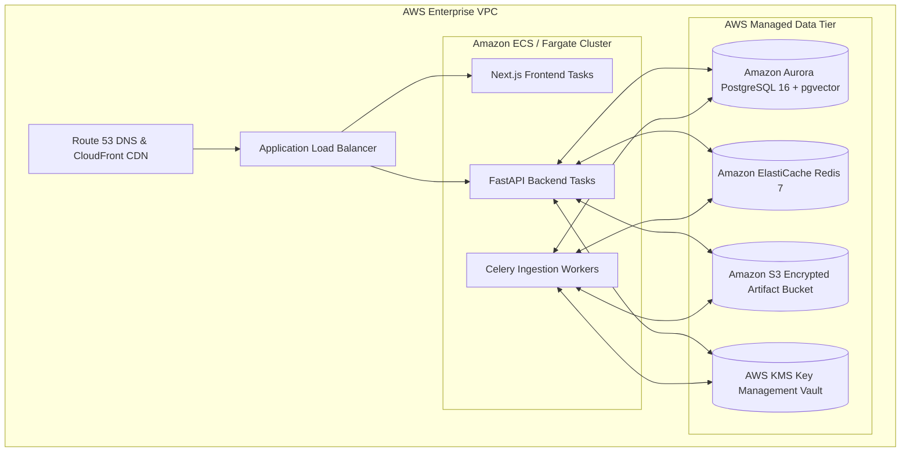

# Deployment — Cloud Infrastructure Deployment (AWS, GCP, Azure)

## Status
**Status:** 📋 PLANNED (Production Cloud Architecture Specification)

---

## 1. AWS Cloud Reference Architecture

```mermaid
graph TD
    subgraph AWS_Cloud [AWS Enterprise VPC]
        Route53[Route 53 DNS & CloudFront CDN] --> ALB[Application Load Balancer]
        
        subgraph ECS_Cluster [Amazon ECS / Fargate Cluster]
            FE_Tasks[Next.js Frontend Tasks]
            BE_Tasks[FastAPI Backend Tasks]
            Worker_Tasks[Celery Ingestion Workers]
        end

        subgraph Managed_Data [AWS Managed Data Tier]
            RDS[(Amazon Aurora PostgreSQL 16 + pgvector)]
            ElastiCache[(Amazon ElastiCache Redis 7)]
            S3[(Amazon S3 Encrypted Artifact Bucket)]
            KMS[(AWS KMS Key Management Vault)]
        end
    end

    ALB --> FE_Tasks
    ALB --> BE_Tasks
    
    BE_Tasks & Worker_Tasks <--> RDS
    BE_Tasks & Worker_Tasks <--> ElastiCache
    BE_Tasks & Worker_Tasks <--> S3
    BE_Tasks & Worker_Tasks <--> KMS
```
