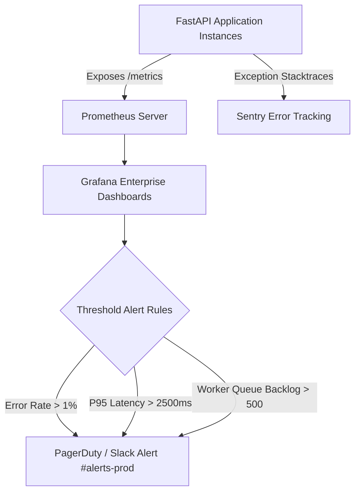

# Deployment — Production Monitoring, Health Probes & Uptime Alerts

## Status
**Status:** ✅ IMPLEMENTED (Prometheus Exporter, Sentry Error Tracking & Uptime Probes)

---

## 1. Monitoring Stack Architecture

---

## 2. Standard Alerting Thresholds

| Metric Alert | Threshold | Severity | Notification Channel |
| :--- | :--- | :--- | :--- |
| **API High 5xx Error Rate** | $> 1.0\%$ of requests over 5 min | Critical | PagerDuty On-Call + Slack |
| **Database Pool Exhaustion**| $> 90\%$ pool active for $> 2$ min | Critical | PagerDuty On-Call |
| **RAG Retrieval Failure Rate**| $> 2.0\%$ zero-vector returns | Warning | Slack `#ai-telemetry` |
| **Celery Queue Lag** | $> 250$ unprocessed tasks | Warning | Slack `#ops-queue` |
