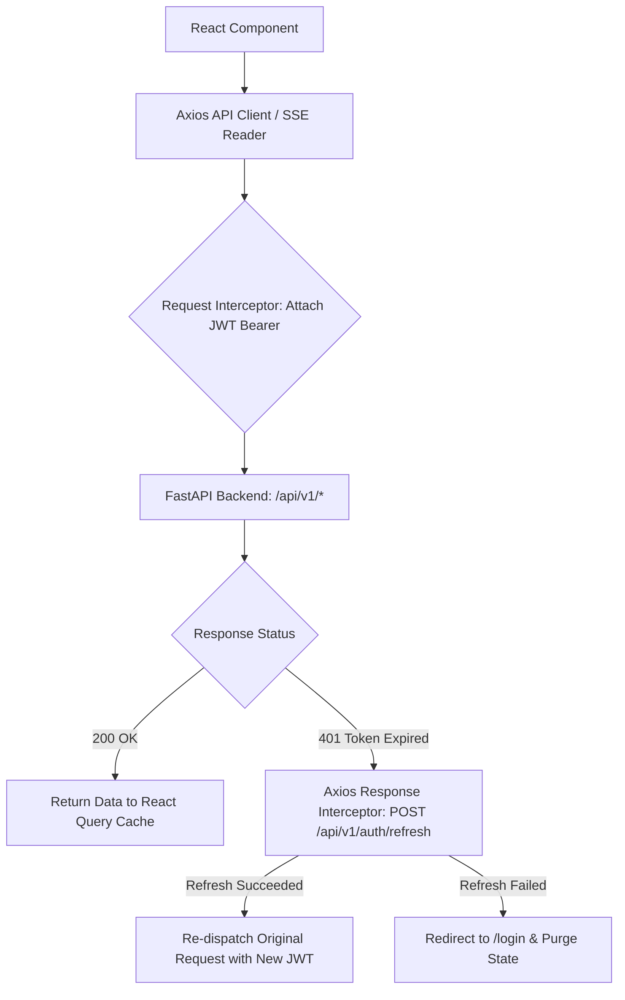

# Frontend — API Integration & Streaming Protocols

## Status
**Status:** ✅ IMPLEMENTED (Axios Interceptors, SSE Stream Consumer & WebSocket Client)

---

## 1. Client-Side API Architecture

The frontend communicates with the FastAPI gateway via a centralized Axios instance configured with JWT refresh interceptors, SSE streaming readers, and WebSocket listeners.



---

## 2. Server-Sent Events (SSE) Wire Protocol

Streaming endpoints emit structured JSON events:
```text
event: step_start
data: {"agent": "supervisor", "task": "Decomposing goals", "timestamp": "2026-08-15T14:30:01Z"}

event: token
data: {"content": "Based "}

event: token
data: {"content": "on the verified "}

event: token
data: {"content": "invoice..."}

event: citation
data: {"source": "Invoice_8812.pdf", "page": 1, "score": 0.99}

event: done
data: {"status": "SUCCESS", "total_duration_ms": 1420}
```
