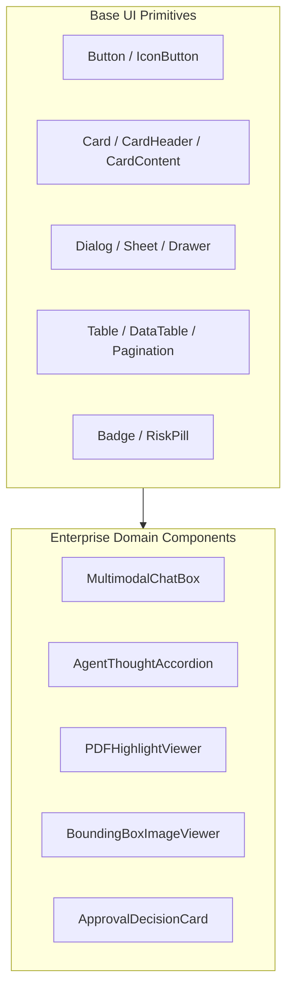

# Frontend — Reusable Component Library & Design System

## Status
**Status:** ✅ IMPLEMENTED (Shadcn UI & Radix UI Component Primitives)

---

## 1. Core Component Catalog

OmniAgent AI leverages **Shadcn UI** (Tailwind CSS + Radix UI Primitives) to ensure accessible, responsive, and composable UI blocks.

---

## 2. Key Domain Components

### 1. `AgentThoughtAccordion`
Renders intermediate multi-agent execution steps in real-time. Collapsible sections display agent names (Supervisor, Document Agent, Database Agent), execution latency (e.g., `0.4s`), and raw tool arguments.

### 2. `BoundingBoxImageViewer`
Renders canvas overlay boxes on uploaded inspection images based on normalized coordinate arrays `[ymin, xmin, ymax, xmax]` with confidence labels.

### 3. `PDFHighlightViewer`
Wraps `pdfjs-dist` to render vector PDFs in the browser sidecar, automatically scrolling to and highlighting page coordinates cited by the RAG Agent.
