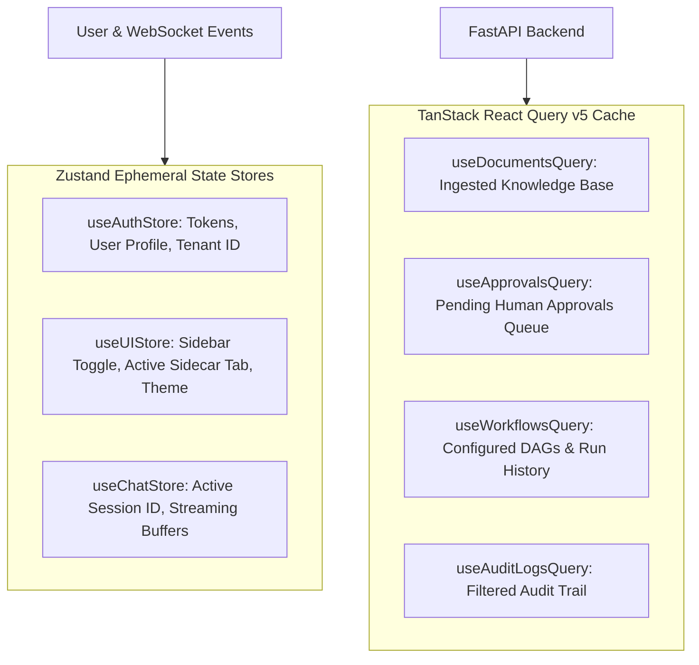

# Frontend — State Management Strategy (Zustand & React Query)

## Status
**Status:** ✅ IMPLEMENTED (Zustand Client Stores + TanStack Query Server State)

---

## 1. Dual-Tier State Architecture

OmniAgent AI separates ephemeral client-side UI state from server data caching:



---

## 2. Streaming State Handler (`useChatStream`)

```typescript
export const useChatStream = (sessionId: string) => {
  const [messages, setMessages] = useState<Message[]>([]);
  const [activeStep, setActiveStep] = useState<AgentStep | null>(null);

  const streamPrompt = (prompt: string, s3Keys: string[]) => {
    const eventSource = new EventSource(
      `/api/v1/chat/sessions/${sessionId}/stream?prompt=${encodeURIComponent(prompt)}`
    );

    eventSource.onmessage = (event) => {
      const payload = JSON.parse(event.data);
      if (payload.type === 'token') {
        // Append streaming text token
      } else if (payload.type === 'agent_step') {
        setActiveStep(payload.data);
      } else if (payload.type === 'done') {
        eventSource.close();
      }
    };
  };

  return { messages, activeStep, streamPrompt };
};
```
