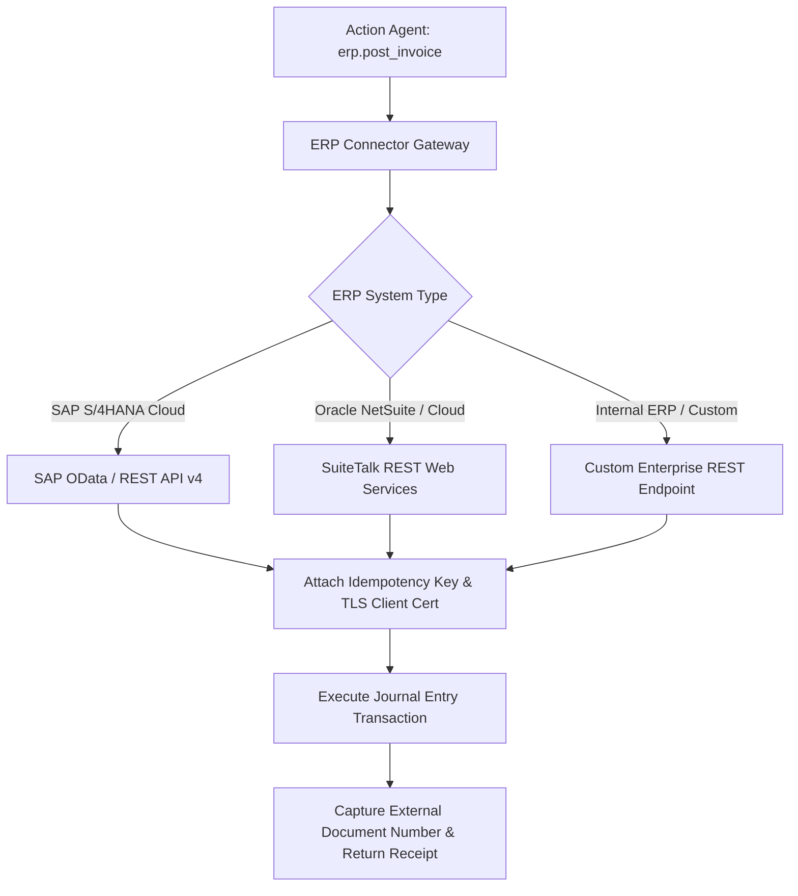

# Integrations — ERP Connectors (SAP S/4HANA, Oracle & Custom REST)

## Status
**Status:** 🚧 PARTIALLY IMPLEMENTED (Generic REST ERP Connector Active; SAP RFC Adapter in Progress)

---

## 1. Enterprise ERP Connector Framework

OmniAgent AI interfaces with enterprise resource planning systems to perform read-only purchase order verification and authorized ledger postings.

---

## 2. Supported ERP Operations

* **`erp.get_purchase_order`**: Fetches PO line items, authorized totals, vendor identifiers, and delivery receipts.
* **`erp.post_invoice`**: Submits a reconciled invoice for general ledger posting with debit/credit account distribution.
* **`erp.check_inventory`**: Queries live stock levels and warehouse bin locations.
