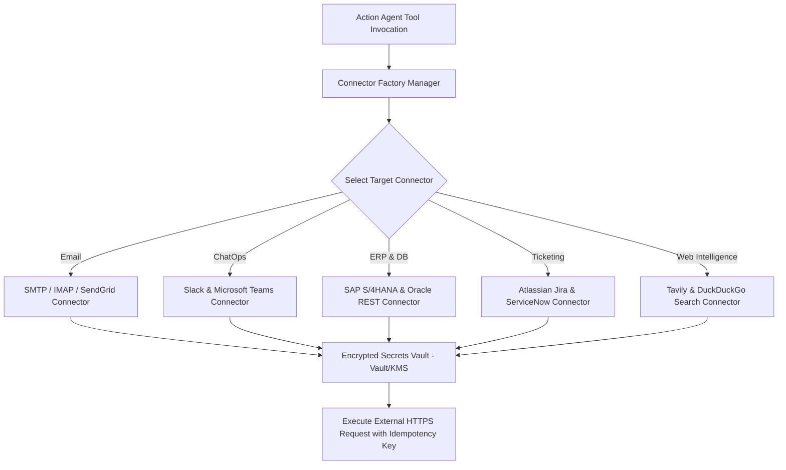

# Integrations — Enterprise System Connectors Overview

## Status
**Status:** ✅ IMPLEMENTED (Connector Framework & Credentials Vault)

---

## 1. Connector Abstraction Architecture

OmniAgent AI communicates with enterprise systems through an extensible **Connector Abstraction Layer** (`app.integrations.connectors`). Connectors handle rate limiting, token refresh, retry logic with exponential backoff, and strict payload serialization.

---

## 2. Secrets & Credential Management

All third-party API keys, OAuth2 client secrets, and SMTP credentials are encrypted at rest using AES-256-GCM in the tenant integration settings table and decrypted in-memory only during tool execution.
