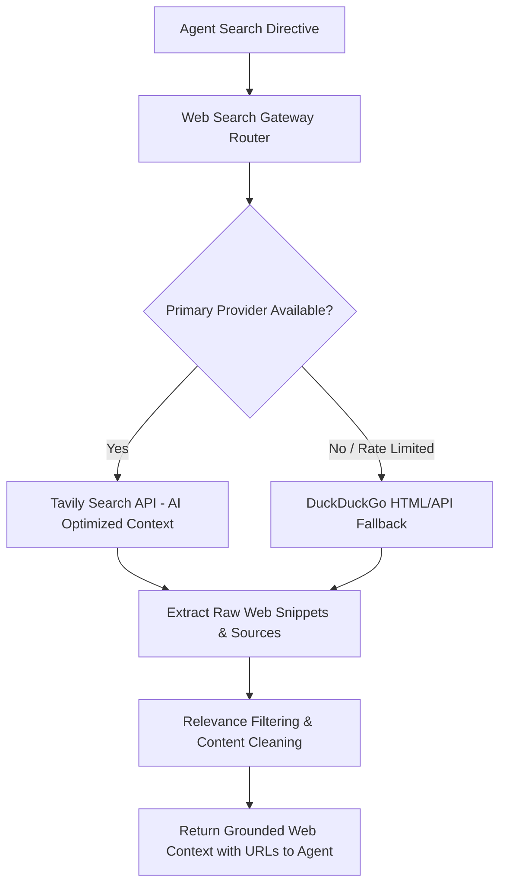

# Integrations — Web Search Connectors (Tavily & DuckDuckGo)

## Status
**Status:** ✅ IMPLEMENTED (Tavily Search API & DuckDuckGo Fallback)

---

## 1. Web Search Architecture

When an enterprise inquiry requires external real-time verification (e.g., checking if a vendor company is actively registered, checking currency foreign exchange rates, or reviewing market competitor prices), the RAG Agent or Supervisor invokes the **Web Search Connector**.



---

## 2. Configuration Parameters

```env
TAVILY_API_KEY=<YOUR_TAVILY_API_KEY>
WEB_SEARCH_MAX_RESULTS=5
WEB_SEARCH_INCLUDE_DOMAINS=["gov.uk", "sec.gov", "bloomberg.com", "reuters.com"]
```
