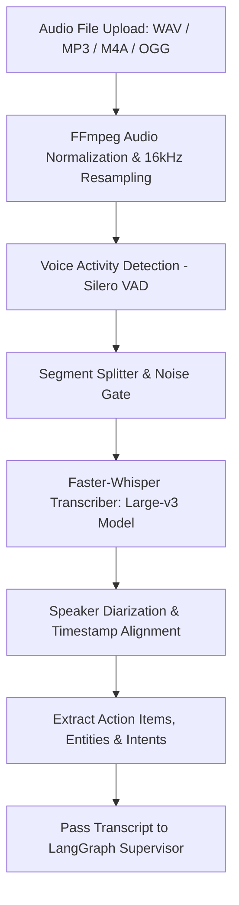

# Multimodal — Audio & Voice Processing Pipeline

## Status
**Status:** ✅ IMPLEMENTED (OpenAI Faster-Whisper ASR & Voice Command Parser)

---

## 1. Voice & Audio Processing Pipeline

The **Audio Ingestion Subsystem** (`app.multimodal.audio`) processes spoken voice memos, phone call recordings, and executive voice commands into structured, actionable text transcripts.

---

## 2. Technical Specifications

| Parameter | Specification |
| :--- | :--- |
| **ASR Model** | Faster-Whisper `large-v3` (CTranslate2 backend) / OpenAI Whisper API |
| **Supported Audio Formats** | WAV, MP3, AAC, FLAC, OGG, WebM, M4A |
| **Sampling Rate** | Normalized to 16,000 Hz Mono Float32 |
| **Diarization Engine** | PyAnnote Audio (Multi-speaker separation) |
| **Latency Benchmark** | ~ 2.1s processing for 60s audio clip on GPU (RTX 4090 / A10G) |
| **Language Support** | 99 languages with automatic language detection |
