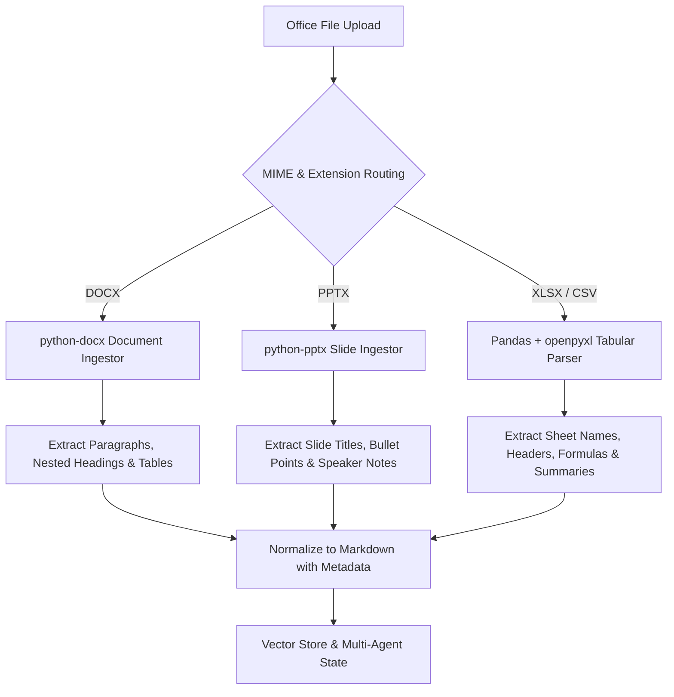

# Multimodal — Office Document Processing (DOCX, PPTX, XLSX)

## Status
**Status:** ✅ IMPLEMENTED (Native python-docx, python-pptx & Pandas Parsers)

---

## 1. Office Ingestion Pipeline

OmniAgent AI supports enterprise office formats without requiring external Microsoft Office licenses or headless LibreOffice dependencies.

---

## 2. Format Specifications

| Format | Library | Key Capabilities |
| :--- | :--- | :--- |
| **DOCX** | `python-docx` | Extracts tracked comments, nested lists, table structures, and inline hyperlinks. |
| **PPTX** | `python-pptx` | Preserves slide order, speaker presentation notes, and embedded chart descriptions. |
| **XLSX / CSV** | `openpyxl` + `pandas` | Computes summary statistics (min/max/sum/mean), identifies primary keys, and preserves cell formulas. |
